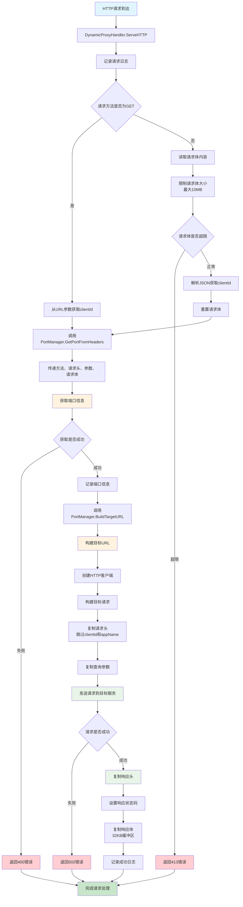
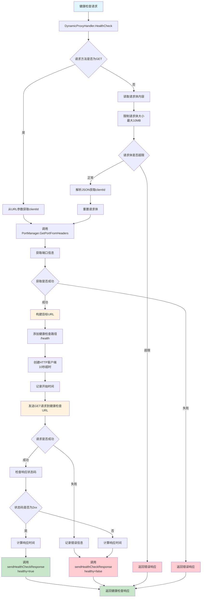

# DynamicProxyHandler 流程图

## 动态代理处理器处理流程



## DynamicProxyHandler.HealthCheck 流程图



## PortManager.GetPortFromHeaders 流程图

```mermaid
graph TD
    A[获取端口信息请求] --> B[GetPortFromHeaders]
    B --> C{请求方法是否为GET}
    C -->|是| D[从params获取clientId]
    C -->|否| E[从body获取clientId]
    
    D --> F{params中是否存在clientId}
    F -->|存在| G[提取clientId值]
    F -->|不存在| H[尝试从headers获取clientId]
    
    E --> I{body长度是否大于0}
    I -->|是| J[解析JSON body]
    J --> K{是否存在clientId字段}
    K -->|存在| L[提取clientId值]
    K -->|不存在| H
    
    I -->|否| H
    
    H --> M{headers中是否存在clientId}
    M -->|存在| N[提取clientId值]
    M -->|不存在| O[返回错误<br/>clientId is required]
    
    G --> P[设置appName<br/>codebase-indexer]
    L --> P
    N --> P
    
    P --> Q[调用GetPort方法]
    Q --> R[构建缓存key<br/>clientID:appName]
    R --> S[检查缓存]
    
    S --> T{缓存是否存在且未过期}
    T -->|是| U[返回缓存的端口信息]
    T -->|否| V[构建请求URL]
    
    V --> W[发送HTTP请求到端口管理服务]
    W --> X{请求是否成功}
    X -->|失败| Y[返回错误]
    X -->|成功| Z[解析响应JSON]
    
    Z --> AA[更新缓存]
    AA --> BB[更新最后访问时间]
    BB --> CC[返回端口信息]
    
    O --> DD[结束]
    Y --> DD
    U --> DD
    CC --> DD

    style A fill:#e1f5fe
    style DD fill:#c8e6c9
    style O fill:#ffcdd2
    style Y fill:#ffcdd2
    style U fill:#fff3e0
    style CC fill:#c8e6c9