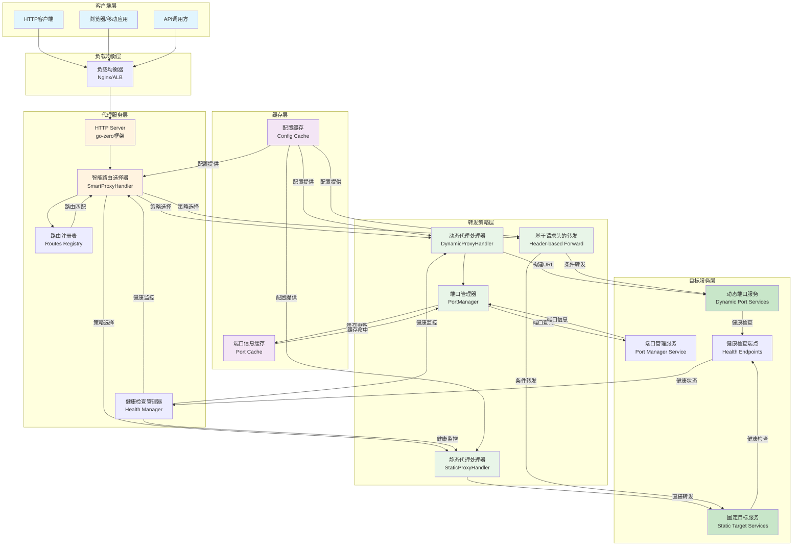
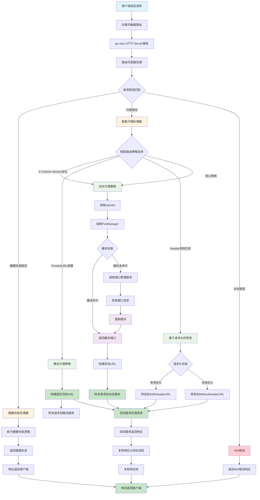
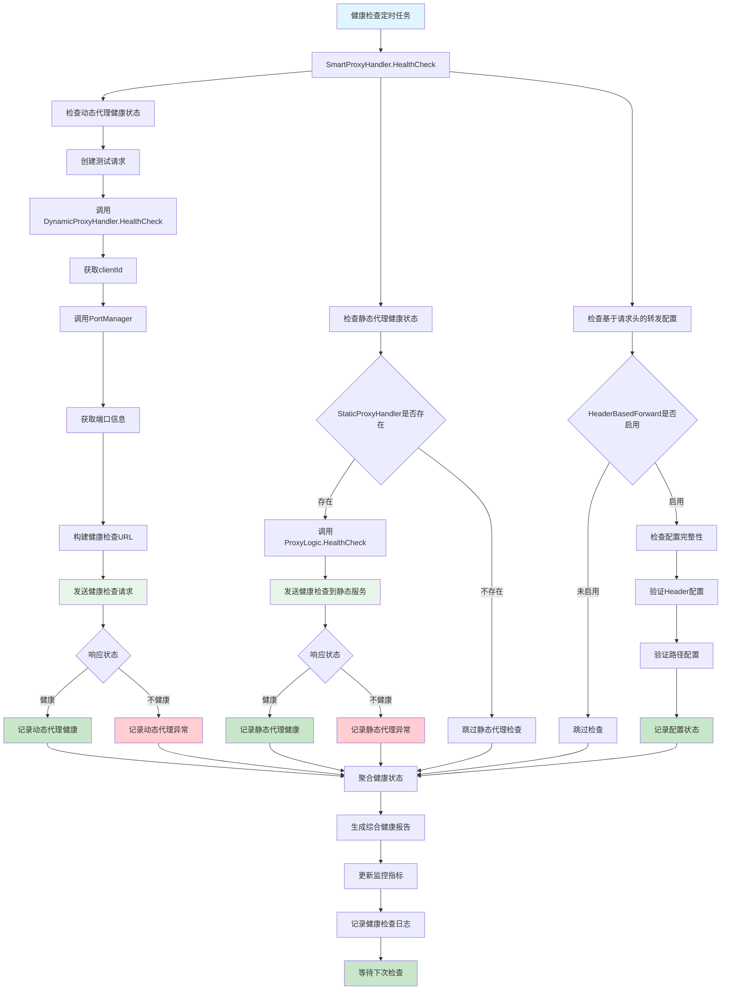
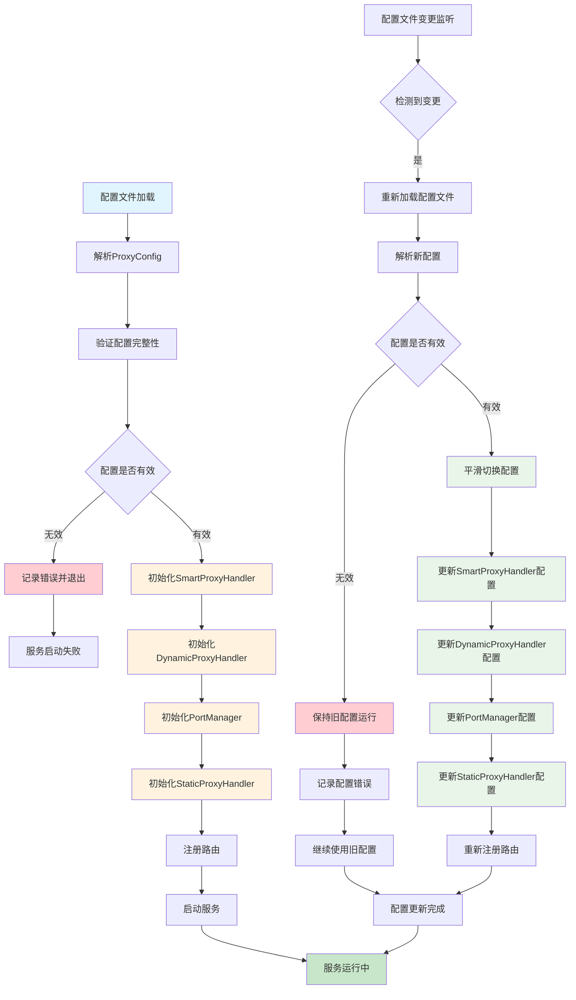

# 整体架构流程图

## 系统整体架构流程



## 请求处理完整流程



## 健康检查监控流程



## 配置管理和热更新流程



## 错误处理和恢复流程

```mermaid
graph TD
    A[请求处理过程中发生错误] --> B{错误类型判断}
    
    B -->|请求验证错误| C[ProxyHandler.validateRequest]
    B -->|端口获取错误| D[PortManager.GetPortFromHeaders]
    B -->|目标连接错误| E[ProxyLogic.Forward]
    B -->|响应处理错误| F[ProxyHandler.copyResponse]
    B -->|超时错误| G[HTTP客户端超时]
    
    C --> H[生成ProxyError]
    D --> H
    E --> H
    F --> H
    G --> H
    
    H --> I{错误码判断}
    I -->|PROXY_BAD_REQUEST| J[返回400错误]
    I -->|PROXY_TARGET_UNREACHABLE| K[返回503错误]
    I -->|PROXY_TIMEOUT| L[返回504错误]
    I -->|PROXY_INTERNAL_ERROR| M[返回500错误]
    I -->|其他错误| N[返回500错误]
    
    J --> O[记录错误日志]
    K --> O
    L --> O
    M --> O
    N --> O
    
    O --> P[错误响应返回客户端]
    P --> Q[错误处理完成]
    
    R[错误恢复机制] --> S[检测错误频率]
    S --> T{错误频率是否过高}
    T -->|是| U[触发熔断机制]
    T -->|否| V[继续正常处理]
    
    U --> W[暂时停止转发]
    W --> X[定期尝试恢复]
    X --> Y{恢复是否成功}
    Y -->|成功| Z[恢复正常服务]
    Y -->|失败| W
    
    Z --> V

    style A fill:#ffcdd2
    style Q fill:#c8e6c9
    style H fill:#ffcdd2
    style J fill:#ffcdd2
    style K fill:#ffcdd2
    style L fill:#ffcdd2
    style M fill:#ffcdd2
    style N fill:#ffcdd2
    style O fill:#fff3e0
    style U fill:#fff3e0
    style Z fill:#c8e6c9