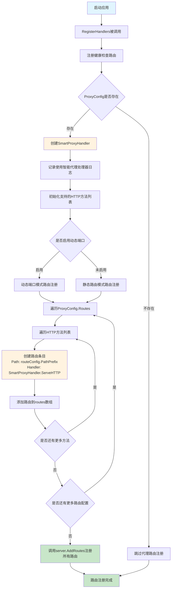
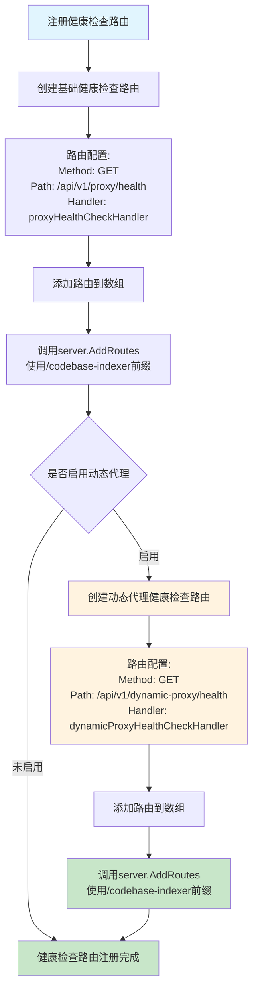
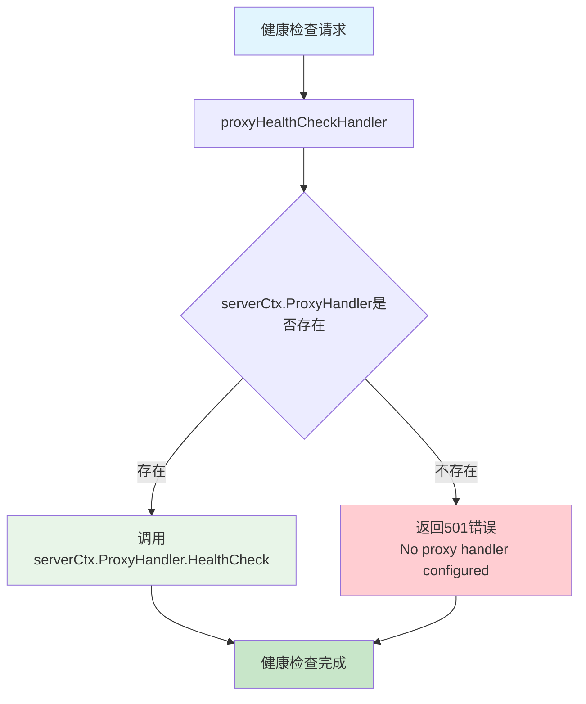
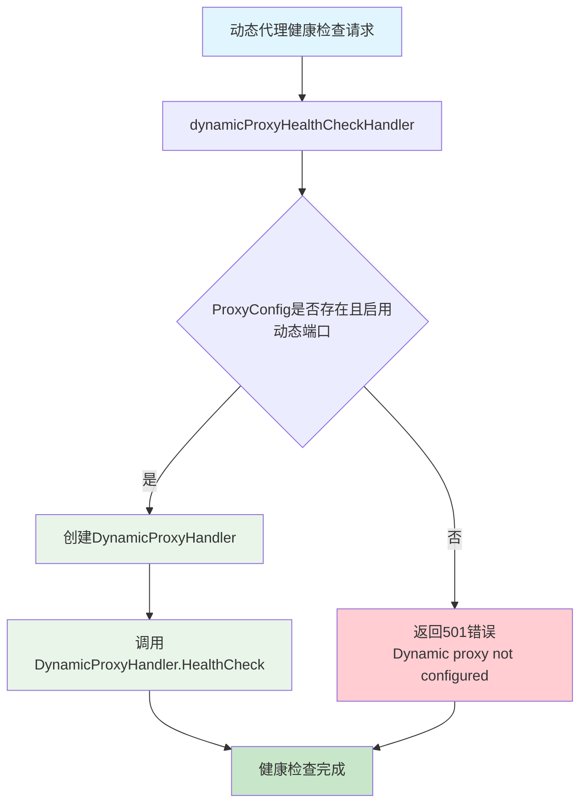
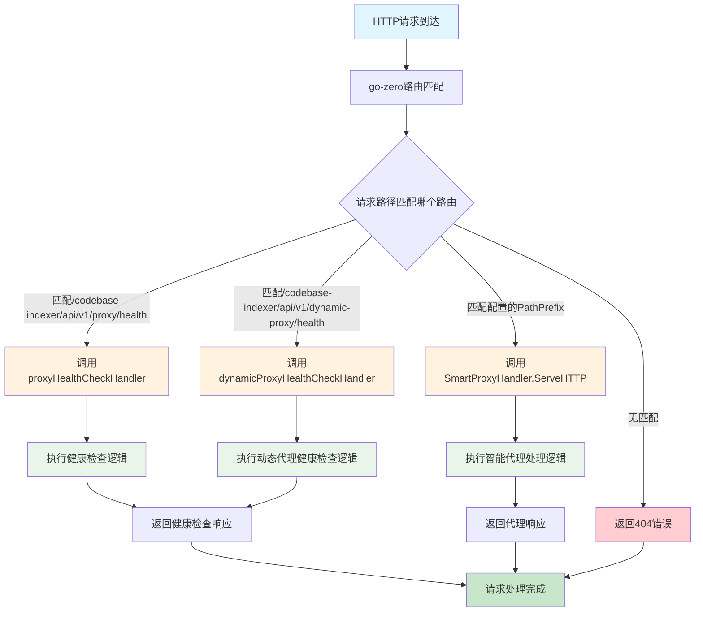
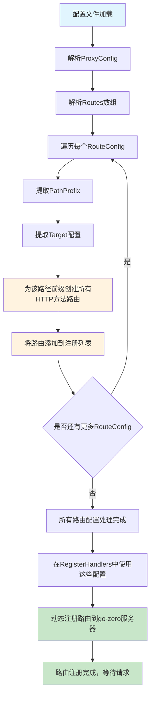

# 路由注册流程图

## RegisterHandlers 流程图



## registerHealthCheckRoutes 流程图



## proxyHealthCheckHandler 流程图



## dynamicProxyHealthCheckHandler 流程图



## 路由匹配和处理流程图



## 配置驱动的路由注册流程图



## 路由优先级和处理顺序流程图

```mermaid
graph TD
    A[HTTP请求到达] --> B[go-zero路由器开始匹配]
    B --> C[检查静态路由优先级]
    
    C --> D[1. 健康检查路由<br/>/codebase-indexer/api/v1/proxy/health]
    C --> E[2. 动态代理健康检查路由<br/>/codebase-indexer/api/v1/dynamic-proxy/health]
    C --> F[3. 配置的代理路由<br/>/codebase-indexer/{PathPrefix}]
    
    D --> G{路径是否完全匹配}
    E --> G
    F --> H{路径是否匹配PathPrefix}
    
    G -->|匹配| I[执行对应的健康检查处理器]
    G -->|不匹配| J[继续检查下一优先级路由]
    H -->|匹配| K[执行SmartProxyHandler]
    H -->|不匹配| L[路由未找到]
    
    I --> M[返回健康检查响应]
    J --> E
    K --> N[执行智能代理逻辑]
    L --> O[返回404错误]
    
    M --> P[请求处理完成]
    N --> P
    O --> P

    style A fill:#e1f5fe
    style P fill:#c8e6c9
    style I fill:#e8f5e8
    style K fill:#e8f5e8
    style L fill:#ffcdd2
    style O fill:#ffcdd2
    style N fill:#fff3e0