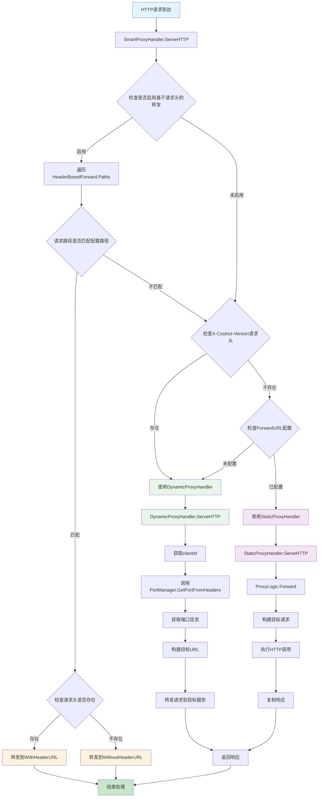

# SmartProxyHandler 流程图

## 智能代理处理器处理流程



## SmartProxyHandler.HealthCheck 流程图

```mermaid
graph TD
    A[健康检查请求] --> B[SmartProxyHandler.HealthCheck]
    B --> C[创建HealthStatus结构]
    C --> D[检查动态代理健康状态]
    D --> E[调用checkDynamicProxyHealth]
    E --> F[创建临时请求]
    F --> G[复制请求头]
    G --> H[创建响应记录器]
    H --> I[调用DynamicProxyHandler.HealthCheck]
    I --> J[记录健康状态]
    J --> K[检查静态代理健康状态]
    
    K --> L{StaticProxyHandler是否存在}
    L -->|存在| M[调用checkStaticProxyHealth]
    M --> N[调用ProxyLogic.HealthCheck]
    N --> O[发送健康检查请求]
    O --> P[检查响应状态]
    P --> Q[记录健康状态]
    L -->|不存在| R[跳过静态代理检查]
    
    Q --> S{检查HeaderBasedForward是否启用}
    R --> S
    S -->|启用| T[调用getHeaderBasedForwardStatus]
    T --> U[构建状态信息]
    S -->|未启用| V[跳过基于请求头的转发检查]
    
    U --> W[构建最终响应]
    V --> W
    W --> X[返回JSON响应]
    
    style A fill:#e1f5fe
    style X fill:#c8e6c9
    style I fill:#e8f5e8
    style N fill:#f3e5f5
    style U fill:#fff3e0