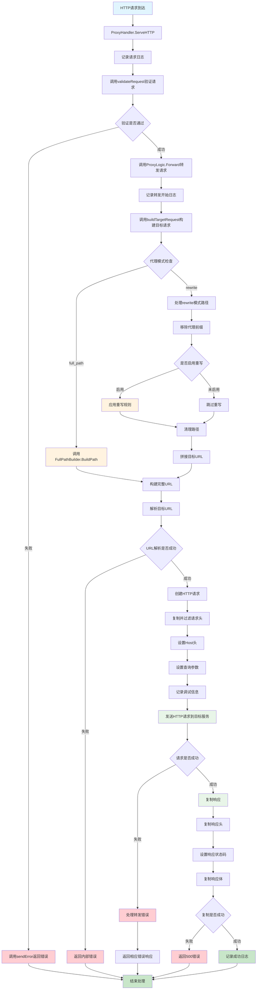
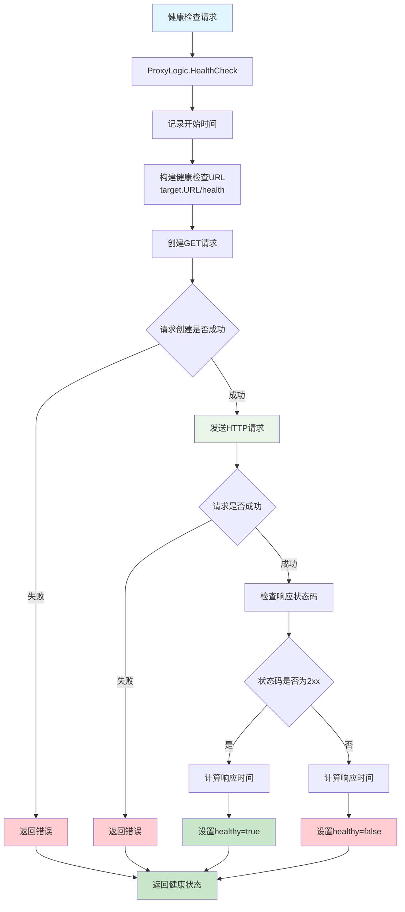
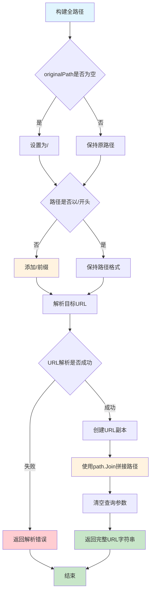

# StaticProxyHandler 流程图

## 静态代理处理器处理流程



## ProxyLogic.buildTargetRequest 流程图

```mermaid
graph TD
    A[构建目标请求] --> B[记录调试信息开始]
    B --> C[记录原始请求路径]
    C --> D[记录完整URL]
    D --> E[记录代理模式]
    E --> F{代理模式判断}
    
    F -->|full_path| G[调用pathBuilder.BuildPath]
    G --> H{路径构建是否成功}
    H -->|失败| I[返回内部错误]
    H -->|成功| J[设置fullURL]
    
    F -->|rewrite| K[获取原始路径]
    K --> L[记录rewrite模式初始路径]
    L --> M{路径是否以/proxy开头}
    M -->|是| N[移除/proxy前缀]
    M -->|否| O[保持路径不变]
    
    N --> P[记录移除前缀后的路径]
    O --> P
    P --> Q{是否启用重写}
    Q -->|启用| R[记录重写规则数量]
    R --> S[复制重写规则]
    S --> T[记录重写前路径]
    T --> U[应用路径重写]
    U --> V[记录重写后路径]
    Q -->|未启用| W[跳过重写]
    
    V --> X[清理路径]
    W --> X
    X --> Y[记录清理后的路径]
    Y --> Z[拼接目标URL]
    Z --> J
    
    J --> AA{是否有查询参数}
    AA -->|有| BB[添加查询参数到URL]
    AA -->|无| CC[保持URL不变]
    BB --> DD[记录最终目标URL]
    CC --> DD
    DD --> EE[记录调试信息结束]
    
    EE --> FF[解析目标URL]
    FF --> GG{URL解析是否成功}
    GG -->|失败| I
    GG -->|成功| HH[创建HTTP请求]
    
    HH --> II[复制并过滤请求头]
    II --> JJ{目标URL是否有Host}
    JJ -->|有| KK[设置Host头]
    JJ -->|无| LL[跳过Host头设置]
    
    KK --> MM[设置过滤后的请求头]
    LL --> MM
    MM --> NN[设置查询参数]
    NN --> OO[返回构建好的请求]
    
    I --> PP[结束]
    OO --> PP

    style A fill:#e1f5fe
    style PP fill:#c8e6c9
    style I fill:#ffcdd2
    style GG fill:#ffcdd2
    style G fill:#fff3e0
    style U fill:#fff3e0
    style HH fill:#e8f5e8
    style OO fill:#c8e6c9
```



## ProxyLogic.HealthCheck 流程图



## 路径构建器流程图

### FullPathBuilder.BuildPath 流程



### RewritePathBuilder.BuildPath 流程

```mermaid
graph TD
    A[构建重写路径] --> B{重写规则是否为空}
    B -->|是| C[返回原始路径]
    B -->|否| D[遍历重写规则]
    
    D --> E{当前规则是否匹配路径前缀}
    E -->|匹配| F[执行路径替换]
    E -->|不匹配| G[检查下一条规则]
    
    F --> H[记录路径重写日志]
    H --> I[返回新路径]
    G --> J{是否还有更多规则}
    J -->|是| D
    J -->|否| C
    
    C --> K[结束]
    I --> K

    style A fill:#e1f5fe
    style K fill:#c8e6c9
    style F fill:#fff3e0
    style H fill:#fff3e0
    style I fill:#c8e6c9