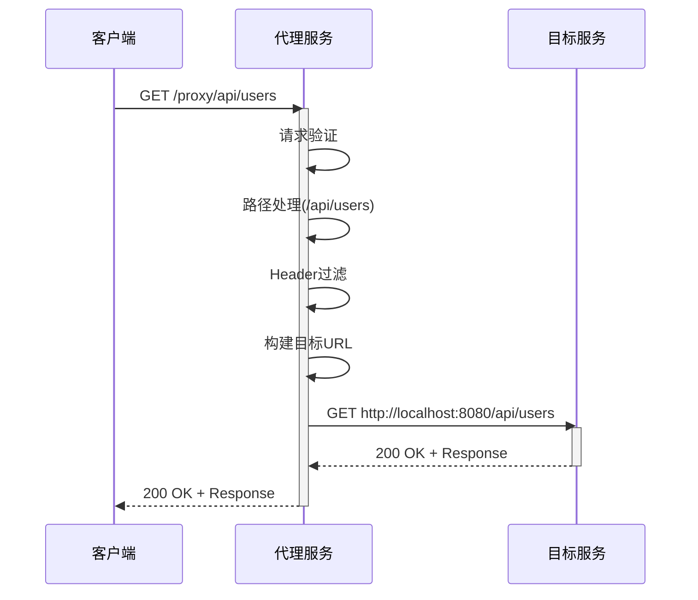

# Codebase Querier 功能文档

## 项目概述

Codebase Querier 是一个智能代码库查询和分析工具，提供代码结构分析、语义搜索、关系追踪和HTTP代理转发等功能。它能够帮助开发者快速理解代码库结构、查找代码定义、分析代码关系，并通过HTTP代理功能实现API请求的转发和调试。

## 核心功能特性

### 1. 代码库管理功能

#### 1.1 代码库目录浏览
- **功能描述**: 获取代码库的完整目录结构，支持递归浏览
- **使用场景**: 快速了解项目结构，定位特定文件或目录
- **支持特性**:
  - 支持指定子目录浏览
  - 可控制目录深度
  - 可选择是否包含文件信息
  - 显示文件大小和编程语言类型

#### 1.2 代码库哈希管理
- **功能描述**: 计算并管理代码库中所有文件的哈希值
- **使用场景**: 检测代码库变化，实现增量更新
- **支持特性**:
  - 文件级哈希计算
  - 快速变化检测
  - 支持增量同步

### 2. 代码分析功能

#### 2.1 代码结构解析
- **功能描述**: 解析单个文件的代码结构，提取类、函数、变量等定义
- **使用场景**: 快速了解文件内部的代码组织
- **支持特性**:
  - 多语言支持（JavaScript、TypeScript、Go、Python等）
  - 精确定位代码位置（行列信息）
  - 提取代码片段和定义内容

#### 2.2 符号定义查询
- **功能描述**: 根据代码位置或内容查询符号的详细定义信息
- **使用场景**: 跳转到定义、查看函数签名、了解类结构
- **支持特性**:
  - 基于位置的精确查询
  - 基于内容的模糊匹配
  - 返回完整的定义信息

### 3. 代码关系分析

#### 3.1 符号关系追踪
- **功能描述**: 分析代码符号之间的引用关系，构建关系树
- **使用场景**: 理解代码依赖关系、分析变更影响范围
- **支持特性**:
  - 支持函数、类、变量等多种符号类型
  - 层级化关系展示
  - 可控制关系深度
  - 支持代码内容预览

#### 3.2 引用关系可视化
- **功能描述**: 以树形结构展示符号的引用和被引用关系
- **使用场景**: 代码审查、重构分析、依赖关系理解

### 4. 智能搜索功能

#### 4.1 语义代码搜索
- **功能描述**: 基于自然语言查询进行语义化代码搜索
- **使用场景**: 通过描述性语言查找相关代码
- **支持特性**:
  - 自然语言查询支持
  - 语义相似度排序
  - 支持结果数量控制
  - 代码片段预览

#### 4.2 智能结果排序
- **功能描述**: 基于AI模型对搜索结果进行相关性排序
- **使用场景**: 快速找到最相关的代码片段

### 5. 文件操作功能

#### 5.1 文件内容获取
- **功能描述**: 获取指定文件的完整或部分内容
- **使用场景**: 查看源代码、代码审查、内容分析
- **支持特性**:
  - 支持行范围选择
  - 原始格式返回
  - 大文件支持

#### 5.2 文件同步上传
- **功能描述**: 批量上传并同步代码库文件
- **使用场景**: 初始化代码库、增量更新
- **支持特性**:
  - 批量文件处理
  - 增量同步机制
  - 元数据支持

### 6. 索引管理功能

#### 6.1 索引状态管理
- **功能描述**: 管理代码库的索引状态，包括嵌入索引和代码图索引
- **使用场景**: 监控索引状态、触发重新索引
- **支持特性**:
  - 实时状态查询
  - 支持多种索引类型
  - 索引进度跟踪

#### 6.2 索引任务管理
- **功能描述**: 创建和管理索引构建任务
- **使用场景**: 批量索引构建、定时索引更新
- **支持特性**:
  - 异步任务处理
  - 任务状态跟踪
  - 支持选择性索引

#### 6.3 索引清理
- **功能描述**: 删除指定类型或完整的代码库索引
- **使用场景**: 重建索引、释放存储空间

### 7. HTTP代理转发功能

#### 7.1 反向代理服务
- **功能描述**: 提供HTTP反向代理功能，将请求转发到指定目标服务
- **使用场景**: API调试、服务代理、跨域请求处理
- **支持特性**:
  - 支持所有HTTP方法（GET、POST、PUT、DELETE等）
  - 完整的请求和响应透传
  - 可配置的目标地址
  - 请求超时控制

#### 7.2 路径重写
- **功能描述**: 支持基于配置的路径重写规则
- **使用场景**: API版本管理、路径标准化
- **支持特性**:
  - 前缀匹配和替换
  - 正则表达式支持
  - 动态路径重写

#### 7.3 Header管理
- **功能描述**: 灵活的HTTP Header管理功能
- **使用场景**: 安全控制、Header标准化
- **支持特性**:
  - Header过滤（黑名单机制）
  - Header覆盖（自定义Header）
  - 敏感信息保护
  - 通配符匹配支持

#### 7.4 健康检查
- **功能描述**: 提供代理服务和目标服务的健康状态检查
- **使用场景**: 服务监控、故障检测
- **支持特性**:
  - 目标服务可达性检测
  - 响应时间测量
  - 详细的健康状态报告

### 7.5 代理转发业务处理流程

#### 7.5.1 请求接收与验证
1. **请求接收**
   - 代理服务监听指定端口，接收所有以`/proxy`为前缀的HTTP请求
   - 支持所有HTTP方法：GET、POST、PUT、DELETE、PATCH、HEAD、OPTIONS
   - 记录请求日志：方法、路径、来源IP等信息

2. **请求验证**
   - **URL长度验证**: 检查请求URL长度不超过8KB限制
   - **Header大小验证**: 检查请求Header总大小不超过1MB限制
   - **HTTP方法验证**: 验证请求方法是否在支持的范围内
   - **安全检查**: 防止恶意请求和攻击

#### 7.5.2 请求处理与转发
1. **路径处理**
   - **代理前缀移除**: 自动移除请求路径中的`/proxy`前缀
   - **路径重写**: 根据配置规则进行路径重写
     ```go
     // 示例：将 /api/v1/proxy/users 重写为 /users
     rules := []RewriteRule{
         {From: "/api/v1/proxy", To: ""}
     }
     ```
   - **路径清理**: 标准化路径格式，移除重复斜杠，确保正确的路径格式

2. **URL构建**
   - 解析配置中的目标服务URL
   - 将处理后的路径与目标URL组合成完整的目标URL
   - 保留原始请求的查询参数

3. **Header处理**
   - **Header过滤**: 根据配置排除指定的Header（支持通配符匹配）
     ```go
     exclude := []string{
         "X-Internal-*",    // 排除所有内部Header
         "Authorization",   // 排除认证信息
     }
     ```
   - **Header覆盖**: 根据配置覆盖指定的Header值
     ```go
     override := map[string]string{
         "Host": "localhost:8080",  // 设置目标Host
     }
     ```
   - **连接Header移除**: 自动移除hop-by-hop类型的Header
     ```go
     // 移除的Header包括：
     // Connection, Keep-Alive, Proxy-Connection
     // Proxy-Authenticate, Proxy-Authorization
     // TE, Trailers, Transfer-Encoding, Upgrade
     ```

4. **请求转发**
   - 使用配置的HTTP客户端发送请求到目标服务
   - 支持连接池复用，提高性能
   - 支持请求超时控制
   - 保留原始请求的上下文信息

#### 7.5.3 响应处理与返回
1. **响应接收**
   - 接收目标服务的响应
   - 记录响应状态码和处理时间

2. **响应转发**
   - **状态码复制**: 将目标服务的HTTP状态码原样返回
   - **Header复制**: 将目标服务的响应Header原样返回
   - **Body复制**: 流式传输响应内容，避免大文件内存占用

3. **错误处理**
   - **超时处理**: 检测请求超时，返回504状态码
   - **目标服务不可达**: 检测目标服务连接失败，返回503状态码
   - **内部错误**: 处理代理服务内部错误，返回500状态码
   - **错误响应格式**: 统一的JSON错误响应格式
     ```json
     {
       "code": "PROXY_ERROR_CODE",
       "message": "错误描述",
       "details": "详细错误信息",
       "timestamp": "2024-01-15T10:30:00Z"
     }
     ```

#### 7.5.4 连接管理与性能优化
1. **连接池管理**
   - 最大空闲连接数：100
   - 每个主机的最大空闲连接数：10
   - 空闲连接超时时间：90秒
   - 自动清理无效连接

2. **性能监控**
   - 请求处理时间统计
   - 连接池状态监控
   - 错误率统计

#### 7.5.5 健康检查流程
1. **健康检查触发**
   - 通过`/health/proxy`端点触发健康检查
   - 支持定期自动检查

2. **健康检查执行**
   - 向目标服务的`/health`端点发送GET请求
   - 测量响应时间
   - 检查响应状态码（2xx表示健康）

3. **健康状态报告**
   ```json
   {
     "status": "ok",
     "proxy": {
       "target_url": "http://localhost:8080",
       "reachable": true,
       "response_time_ms": 45
     }
   }
   ```

#### 7.5.6 配置管理
1. **配置加载**
   - 从YAML配置文件加载代理配置
   - 支持环境变量覆盖配置

2. **配置结构**
   ```yaml
   Proxy:
     Target:
       URL: "http://localhost:8080"     # 目标服务地址
       Timeout: 30s                     # 请求超时时间
     Rewrite:
       Enabled: true                    # 是否启用路径重写
       Rules:                           # 重写规则列表
         - From: "/api/v1/proxy"        # 原始路径前缀
           To: ""                       # 重写后的路径前缀
     Headers:
       PassThrough: true                # 是否透传所有header
       Exclude:                         # 需要排除的header
         - "X-Internal-*"
         - "Authorization"
       Override:                        # 需要覆盖的header
         Host: "localhost:8080"
   ```

#### 7.5.7 错误处理机制
1. **错误类型**
   - **PROXY_BAD_REQUEST**: 请求格式错误（400）
   - **PROXY_TARGET_UNREACHABLE**: 目标服务不可达（503）
   - **PROXY_TIMEOUT**: 请求超时（504）
   - **PROXY_INTERNAL_ERROR**: 代理内部错误（500）

2. **错误处理策略**
   - 详细的错误日志记录
   - 友好的错误消息返回
   - 错误上下文信息保留
   - 适当的HTTP状态码返回

#### 7.5.8 安全特性
1. **Header安全**
   - 敏感Header自动过滤
   - 支持Header黑名单机制
   - 防止信息泄露

2. **路径安全**
   - 路径标准化处理
   - 防止目录遍历攻击
   - 路径长度限制

3. **请求限制**
   - URL长度限制（8KB）
   - Header大小限制（1MB）
   - 支持的HTTP方法限制

#### 7.5.9 完整处理流程示例


## 配置说明

### 代理配置示例

```yaml
# HTTP代理配置
Proxy:
  Target:
    URL: "http://localhost:8080"  # 目标服务地址
    Timeout: 30s                  # 请求超时时间
  Rewrite:
    Enabled: true                 # 是否启用路径重写
    Rules:
      - From: "/api/v1/proxy"     # 原始路径前缀
        To: ""                    # 重写后的路径前缀（空表示移除）
  Headers:
    PassThrough: true             # 是否透传所有header
    Exclude:                      # 需要排除的header
      - "X-Internal-*"
      - "Authorization"
    Override:                     # 需要覆盖的header
      Host: "localhost:8080"
```

### 环境变量支持

- `PROXY_TARGET_URL`: 覆盖配置文件中的目标地址
- `PROXY_TIMEOUT`: 覆盖请求超时时间
- `PROXY_REWRITE_ENABLED`: 启用或禁用路径重写功能

## API接口列表

### 代码库管理接口

| 接口 | 方法 | 路径 | 描述 |
|------|------|------|------|
| 获取目录树 | GET | `/api/v1/codebases/directory` | 获取代码库目录结构 |
| 获取哈希值 | GET | `/api/v1/codebases/hash` | 获取代码库文件哈希 |
| 删除代码库 | DELETE | `/api/v1/codebase` | 删除整个代码库 |

### 代码分析接口

| 接口 | 方法 | 路径 | 描述 |
|------|------|------|------|
| 查询符号定义 | GET | `/api/v1/search/definition` | 查询代码符号定义 |
| 获取文件结构 | GET | `/api/v1/file/structure` | 获取文件代码结构 |
| 获取文件内容 | GET | `/api/v1/files/content` | 获取文件原始内容 |

### 关系分析接口

| 接口 | 方法 | 路径 | 描述 |
|------|------|------|------|
| 查询符号关系 | GET | `/api/v1/search/relation` | 获取符号引用关系树 |

### 搜索接口

| 接口 | 方法 | 路径 | 描述 |
|------|------|------|------|
| 语义搜索 | GET | `/api/v1/search/semantic` | 基于自然语言的代码搜索 |

### 索引管理接口

| 接口 | 方法 | 路径 | 描述 |
|------|------|------|------|
| 获取索引摘要 | GET | `/api/v1/index/summary` | 获取索引状态信息 |
| 创建索引任务 | POST | `/api/v1/index/task` | 创建索引构建任务 |
| 删除索引 | DELETE | `/api/v1/index` | 删除指定类型索引 |

### 文件操作接口

| 接口 | 方法 | 路径 | 描述 |
|------|------|------|------|
| 文件上传 | POST | `/api/v1/files/upload` | 上传并同步代码文件 |

### 代理转发接口

| 接口 | 方法 | 路径 | 描述 |
|------|------|------|------|
| 代理转发 | ALL | `/proxy/*` | 转发HTTP请求到目标服务 |
| 健康检查 | GET | `/health/proxy` | 检查代理服务健康状态 |

## 使用示例

### 1. 基础代码查询

```bash
# 获取项目目录结构
curl -X GET "http://localhost:8080/codebase-indexer/api/v1/codebases/directory?clientId=dev123&codebasePath=/path/to/project"

# 查询函数定义
curl -X GET "http://localhost:8080/codebase-indexer/api/v1/search/definition?clientId=dev123&codebasePath=/path/to/project&filePath=src/main.js&startLine=10&endLine=20"

# 语义搜索
curl -X GET "http://localhost:8080/codebase-indexer/api/v1/search/semantic?clientId=dev123&codebasePath=/path/to/project&query=用户认证实现&topK=5"
```

### 2. 代理转发使用

```bash
# 通过代理访问目标服务
curl -X GET "http://localhost:8080/proxy/api/users"

# POST请求转发
curl -X POST "http://localhost:8080/proxy/api/users" \
  -H "Content-Type: application/json" \
  -d '{"name": "张三", "email": "zhangsan@example.com"}'

# 检查代理健康状态
curl -X GET "http://localhost:8080/health/proxy"
```

### 3. 完整工作流程示例

```bash
# 1. 上传代码库
curl -X POST "http://localhost:8080/codebase-indexer/api/v1/files/upload" \
  -F "clientId=dev123" \
  -F "codebasePath=/path/to/project" \
  -F "codebaseName=my-project"

# 2. 创建索引
curl -X POST "http://localhost:8080/codebase-indexer/api/v1/index/task" \
  -H "Content-Type: application/json" \
  -d '{
    "clientId": "dev123",
    "codebasePath": "/path/to/project",
    "indexType": "all"
  }'

# 3. 查询代码结构
curl -X GET "http://localhost:8080/codebase-indexer/api/v1/file/structure?clientId=dev123&codebasePath=/path/to/project&filePath=src/auth.js"

# 4. 分析代码关系
curl -X GET "http://localhost:8080/codebase-indexer/api/v1/search/relation?clientId=dev123&codebasePath=/path/to/project&filePath=src/auth.js&startLine=15&startColumn=1&endLine=25&endColumn=5&symbolName=authenticateUser"
```

## 错误处理

### 错误响应格式

所有API接口统一使用以下错误响应格式：

```json
{
  "code": "ERROR_CODE",
  "message": "错误描述",
  "details": "详细错误信息",
  "timestamp": "2024-01-15T10:30:00Z"
}
```

### 代理特定错误码

| 错误码 | 描述 | HTTP状态码 |
|--------|------|------------|
| PROXY_BAD_REQUEST | 请求格式错误 | 400 |
| PROXY_TARGET_UNREACHABLE | 目标服务不可达 | 503 |
| PROXY_TIMEOUT | 请求超时 | 504 |
| PROXY_INTERNAL_ERROR | 代理内部错误 | 500 |

## 性能特性

- **响应时间**: 本地查询 < 100ms
- **并发支持**: 支持100+并发请求
- **内存使用**: 稳定内存占用，支持大文件处理
- **缓存机制**: 智能缓存热点查询结果
- **连接池**: HTTP连接复用，提升代理性能

## 安全特性

- **Header过滤**: 支持敏感Header的自动过滤
- **路径验证**: 防止目录遍历攻击
- **超时控制**: 防止长时间挂起
- **错误信息**: 避免泄露内部实现细节
- **HTTPS支持**: 支持HTTPS目标地址

## 扩展性

- **插件架构**: 支持自定义分析插件
- **多语言支持**: 可扩展支持更多编程语言
- **自定义规则**: 支持自定义代码分析规则
- **API扩展**: 易于添加新的API接口
- **配置灵活**: 支持多种配置方式（文件、环境变量、API）