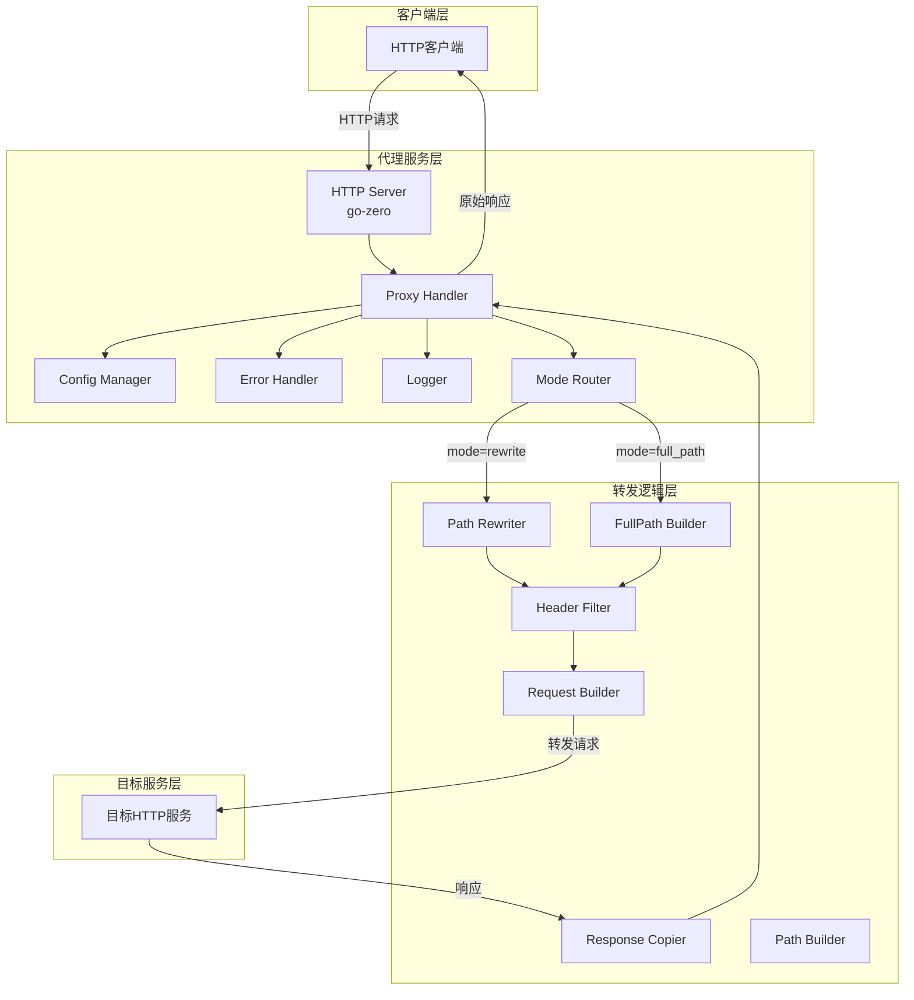
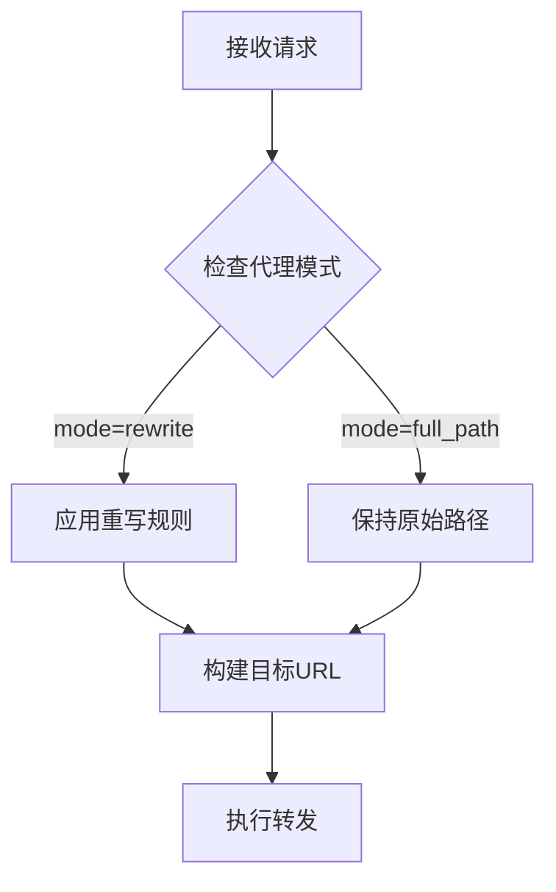
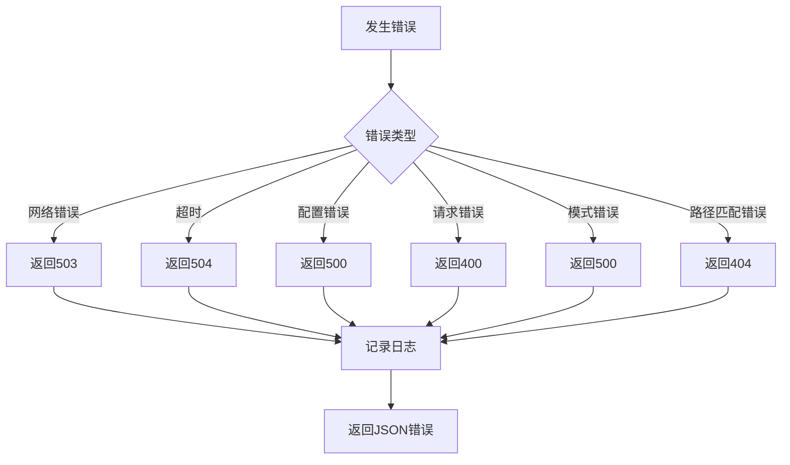

# HTTP协议转发功能技术设计文档

## 1. 设计概述

### 1.1 设计目标
基于现有Codebase Querier项目架构，实现轻量级HTTP反向代理功能，支持请求转发、响应透传和错误处理。重点解决 RegisterHandlers 函数中的路径匹配问题，确保全路径模式下能够正确匹配所有路径包括根路径 "/"。

### 1.2 设计范围
- 路径匹配问题修复
- 核心转发功能实现
- 配置管理集成
- 错误处理机制
- 性能优化策略
- 安全控制措施
- 全路径转发功能
- 代理模式切换机制

## 2. 技术选型

### 2.1 技术栈选择
| 组件 | 技术 | 版本 | 选择理由 |
|------|------|------|----------|
| 框架 | go-zero | v1.8.3 | 与现有项目保持一致，提供完整Web框架 |
| HTTP客户端 | net/http | Go标准库 | 性能优秀，无需额外依赖 |
| 配置管理 | go-zero config | 内置 | 与现有配置系统兼容 |
| 日志 | go-zero logx | 内置 | 统一日志格式和级别 |
| 监控 | Prometheus | 集成 | 利用go-zero内置监控支持 |

### 2.2 技术方案对比
| 方案 | 优点 | 缺点 | 选择结果 |
|------|------|------|----------|
| **标准库net/http** | 性能优秀，零依赖，完全控制 | 需手动处理细节 | ✅ 选择 |
| **第三方库(如fasthttp)** | 更高性能，功能丰富 | 增加依赖，学习成本 | ❌ 放弃 |
| **go-zero内置代理** | 集成度高，配置简单 | 功能有限，灵活性差 | ❌ 放弃 |

## 3. 系统架构

### 3.1 整体架构图


### 3.2 模块划分

#### 3.2.1 配置模块 (internal/config/proxy.go)
- **职责**: 管理代理配置，支持热加载
- **功能**:
  - 解析YAML配置文件
  - 支持环境变量覆盖
  - 配置验证和错误提示
  - 代理模式配置管理

#### 3.2.2 处理器模块 (internal/handler/proxy.go)
- **职责**: 接收HTTP请求并协调转发流程
- **功能**:
  - 请求路由匹配
  - 代理模式路由
  - 调用转发逻辑
  - 错误处理和响应

#### 3.2.3 路由注册模块 (internal/handler/routes.go)
- **职责**: 注册HTTP路由，处理路径匹配
- **功能**:
  - 路径匹配策略实现
  - 全路径模式路由注册
  - 重写模式路由注册
  - 健康检查路由注册

#### 3.2.4 转发逻辑模块 (internal/logic/proxy.go)
- **职责**: 核心转发逻辑实现
- **功能**:
  - 构建转发请求
  - 执行HTTP调用
  - 处理响应数据
  - 路径构建策略

#### 3.2.5 工具模块 (internal/utils/proxy/)
- **职责**: 提供通用工具函数
- **功能**:
  - 路径重写
  - 全路径构建
  - Header过滤
  - 错误格式化

## 4. 路径匹配问题解决方案

### 4.1 问题分析
当前 RegisterHandlers 函数中的路径匹配问题主要体现在：

1. **全路径模式下的路径匹配问题**：
   - 当前使用 `"/*path"` 作为路径模式
   - 在 go-zero 框架中无法正确匹配根路径 "/"
   - 对某些特殊路径结构匹配失败

2. **前缀配置与路径匹配的冲突**：
   - 所有路由都配置了 `rest.WithPrefix("/codebase-indexer")` 前缀
   - 前缀与路径模式结合导致实际匹配路径不符合预期

3. **路径匹配逻辑的不一致性**：
   - 健康检查路由使用固定路径：`"/api/v1/proxy/health"`
   - 全路径模式使用：`"/*path"`
   - rewrite模式使用：`"/api/v1/proxy/*path"`
   - 不一致性导致某些情况下路径匹配失败

### 4.2 解决方案设计

#### 4.2.1 路径匹配策略优化
**核心策略**: 统一使用 `"/*"` 通配符替代 `"/*path"`

```go
// 修改前：使用 "/*path"
Path: "/*path"

// 修改后：使用 "/*"
Path: "/*"
```

**优势分析**:
- `"/*"` 在 go-zero 框架中能够匹配所有路径，包括根路径 "/"
- 避免了 `"/*path"` 通配符的路径匹配限制
- 简化了路径匹配逻辑，提高可靠性

#### 4.2.2 路由注册架构优化

```mermaid
graph TD
    A[RegisterHandlers] --> B{检查代理模式}
    B -->|full_path| C[注册全路径模式路由]
    B -->|rewrite| D[注册重写模式路由]
    B -->|always| E[注册健康检查路由]
    
    C --> F[使用 "/*" 通配符]
    D --> G[使用 "/api/v1/proxy/*" 前缀]
    E --> H[使用固定路径]
    
    F --> I[支持根路径匹配]
    G --> J[支持前缀路径匹配]
    H --> K[健康检查专用]
```

#### 4.2.3 前缀配置兼容性处理
**策略**: 保持现有前缀配置不变，优化路径模式与前缀的组合

```go
// 当前配置
rest.WithPrefix("/codebase-indexer")

// 全路径模式实际匹配路径：/codebase-indexer/*
// 重写模式实际匹配路径：/codebase-indexer/api/v1/proxy/*
// 健康检查实际匹配路径：/codebase-indexer/api/v1/proxy/health
```

### 4.3 详细实现方案

#### 4.3.1 路由注册函数重构

```go
func RegisterHandlers(server *rest.Server, serverCtx *svc.ServiceContext) {
    // 1. 注册健康检查路由（保持不变）
    registerHealthCheckRoutes(server, serverCtx)
    
    // 2. 根据代理模式注册代理路由
    if serverCtx.Config.ProxyConfig != nil {
        switch serverCtx.Config.ProxyConfig.Mode {
        case config.ProxyModeFullPath:
            registerFullPathRoutes(server, serverCtx)
        case config.ProxyModeRewrite:
            registerRewriteRoutes(server, serverCtx)
        default:
            // 默认使用重写模式，保持向后兼容
            registerRewriteRoutes(server, serverCtx)
        }
    }
}

// 注册健康检查路由
func registerHealthCheckRoutes(server *rest.Server, serverCtx *svc.ServiceContext) {
    server.AddRoutes(
        []rest.Route{
            {
                Method:  http.MethodGet,
                Path:    "/api/v1/proxy/health",
                Handler: proxyHealthCheckHandler(serverCtx),
            },
        },
        rest.WithPrefix("/codebase-indexer"),
    )
}

// 注册全路径模式路由
func registerFullPathRoutes(server *rest.Server, serverCtx *svc.ServiceContext) {
    routes := make([]rest.Route, 0, 7)
    
    // 支持的HTTP方法
    methods := []string{
        http.MethodGet,
        http.MethodPost,
        http.MethodPut,
        http.MethodDelete,
        http.MethodPatch,
        http.MethodHead,
        http.MethodOptions,
    }
    
    // 为每个方法创建路由，使用 "/*" 通配符
    for _, method := range methods {
        routes = append(routes, rest.Route{
            Method:  method,
            Path:    "/*", // 使用 "/*" 替代 "/*path"
            Handler: proxyHandler(serverCtx),
        })
    }
    
    server.AddRoutes(routes, rest.WithPrefix("/codebase-indexer"))
}

// 注册重写模式路由（保持现有逻辑）
func registerRewriteRoutes(server *rest.Server, serverCtx *svc.ServiceContext) {
    routes := make([]rest.Route, 0, 7)
    
    methods := []string{
        http.MethodGet,
        http.MethodPost,
        http.MethodPut,
        http.MethodDelete,
        http.MethodPatch,
        http.MethodHead,
        http.MethodOptions,
    }
    
    for _, method := range methods {
        routes = append(routes, rest.Route{
            Method:  method,
            Path:    "/api/v1/proxy/*", // 保持现有的前缀匹配
            Handler: proxyHandler(serverCtx),
        })
    }
    
    server.AddRoutes(routes, rest.WithPrefix("/codebase-indexer"))
}
```

#### 4.3.2 路径处理逻辑优化

```go
// 在处理器中优化路径解析逻辑
func handleFullPathProxy(w http.ResponseWriter, r *http.Request, cfg *config.ProxyConfig) {
    // 获取完整的原始路径（包括根路径）
    originalPath := r.URL.Path
    
    // 记录调试信息
    logx.Infof("[PROXY_DEBUG] Full path mode - originalPath: %s", originalPath)
    
    // 构建目标URL - 直接拼接目标URL和原始路径
    targetURL := buildTargetURL(cfg.Target.URL, originalPath, r.URL.RawQuery)
    
    // 继续原有的代理逻辑...
}

func buildTargetURL(baseURL, path, query string) string {
    // 规范化URL拼接
    if !strings.HasSuffix(baseURL, "/") && !strings.HasPrefix(path, "/") {
        baseURL += "/"
    }
    
    targetURL := baseURL + path
    
    if query != "" {
        targetURL += "?" + query
    }
    
    return targetURL
}
```

### 4.4 兼容性保证

#### 4.4.1 向后兼容性
- **重写模式**: 保持现有的 `/api/v1/proxy/*` 路径模式不变
- **配置格式**: 保持现有配置格式，默认模式仍为 rewrite
- **API接口**: 健康检查接口路径保持不变

#### 4.4.2 前缀配置处理
- **统一前缀**: 所有路由继续使用 `/codebase-indexer` 前缀
- **路径匹配**: 优化后的路径模式与前缀配置完全兼容
- **实际匹配路径**:
  - 全路径模式: `/codebase-indexer/*` → 匹配所有以 `/codebase-indexer/` 开头的路径
  - 重写模式: `/codebase-indexer/api/v1/proxy/*` → 匹配代理前缀路径
  - 健康检查: `/codebase-indexer/api/v1/proxy/health` → 固定健康检查路径

## 5. 数据模型设计

### 5.1 配置结构
```go
// ProxyConfig 代理配置
type ProxyConfig struct {
    Mode    string        `json:"mode" yaml:"mode"` // 代理模式: rewrite, full_path
    Target  TargetConfig  `json:"target" yaml:"target"`
    Rewrite RewriteConfig `json:"rewrite" yaml:"rewrite"`
    Headers HeadersConfig `json:"headers" yaml:"headers"`
}

// 代理模式常量
const (
    ProxyModeRewrite  = "rewrite"   // 路径重写模式
    ProxyModeFullPath = "full_path" // 全路径转发模式
)

// TargetConfig 目标服务配置
type TargetConfig struct {
    URL     string        `json:"url" yaml:"url"`
    Timeout time.Duration `json:"timeout" yaml:"timeout"`
}

// RewriteConfig 路径重写配置
type RewriteConfig struct {
    Enabled bool          `json:"enabled" yaml:"enabled"`
    Rules   []RewriteRule `json:"rules" yaml:"rules"`
}

// RewriteRule 重写规则
type RewriteRule struct {
    From string `json:"from" yaml:"from"`
    To   string `json:"to" yaml:"to"`
}

// HeadersConfig Header配置
type HeadersConfig struct {
    PassThrough bool              `json:"pass_through" yaml:"pass_through"`
    Exclude     []string          `json:"exclude" yaml:"exclude"`
    Override    map[string]string `json:"override" yaml:"override"`
}
```

### 5.2 路径构建器接口
```go
// PathBuilder 路径构建器接口
type PathBuilder interface {
    BuildPath(originalPath string) (string, error)
}

// RewritePathBuilder 路径重写构建器
type RewritePathBuilder struct {
    rules []RewriteRule
}

// FullPathBuilder 全路径构建器
type FullPathBuilder struct {
    targetURL string
}
```

### 5.3 错误响应结构
```go
// ProxyError 代理错误响应
type ProxyError struct {
    Code      string    `json:"code"`
    Message   string    `json:"message"`
    Details   string    `json:"details,omitempty"`
    Timestamp time.Time `json:"timestamp"`
}
```

## 6. API接口设计

### 6.1 转发接口
- **路径**: `/proxy/{path...}` (rewrite模式)
- **路径**: `/{any_path...}` (full_path模式)
- **方法**: GET, POST, PUT, DELETE, PATCH, HEAD, OPTIONS
- **描述**: 将请求转发到配置的目标地址
- **请求参数**: 透传所有原始参数
- **响应格式**: 透传目标服务响应

### 6.2 健康检查接口
- **路径**: `/health/proxy`
- **方法**: GET
- **描述**: 检查代理服务和目标服务的健康状态
- **响应格式**:
  ```json
  {
    "status": "ok",
    "proxy": {
      "mode": "full_path",
      "target_url": "http://target-service:8080",
      "reachable": true,
      "response_time_ms": 45
    }
  }
  ```

## 7. 函数接口设计

### 7.1 核心接口定义

#### 7.1.1 ProxyHandler接口
```go
type ProxyHandler interface {
    ServeHTTP(w http.ResponseWriter, r *http.Request)
    HealthCheck() (HealthStatus, error)
}
```

#### 7.1.2 Forwarder接口
```go
type Forwarder interface {
    Forward(ctx context.Context, req *http.Request) (*http.Response, error)
    BuildTargetRequest(ctx context.Context, original *http.Request) (*http.Request, error)
}
```

#### 7.1.3 PathBuilder接口
```go
type PathBuilder interface {
    BuildPath(originalPath string) (string, error)
}
```

### 7.2 关键函数签名

#### 7.2.1 路由注册函数
```go
// RegisterHandlers 注册HTTP处理器
func RegisterHandlers(server *rest.Server, serverCtx *svc.ServiceContext)

// registerHealthCheckRoutes 注册健康检查路由
func registerHealthCheckRoutes(server *rest.Server, serverCtx *svc.ServiceContext)

// registerFullPathRoutes 注册全路径模式路由
func registerFullPathRoutes(server *rest.Server, serverCtx *svc.ServiceContext)

// registerRewriteRoutes 注册重写模式路由
func registerRewriteRoutes(server *rest.Server, serverCtx *svc.ServiceContext)
```

#### 7.2.2 转发处理函数
```go
// HandleProxyRequest 处理代理请求
func HandleProxyRequest(w http.ResponseWriter, r *http.Request, cfg *ProxyConfig) error

// ForwardRequest 执行请求转发
func ForwardRequest(ctx context.Context, client *http.Client, targetReq *http.Request) (*http.Response, error)

// CopyResponse 复制响应数据
func CopyResponse(dst http.ResponseWriter, src *http.Response) error
```

#### 7.2.3 路径构建函数
```go
// BuildRewritePath 构建重写路径
func BuildRewritePath(path string, rules []RewriteRule) string

// BuildFullPath 构建全路径
func BuildFullPath(targetURL, originalPath string) string

// buildTargetURL 构建目标URL（新增）
func buildTargetURL(baseURL, path, query string) string

// GetPathBuilder 根据模式获取路径构建器
func GetPathBuilder(mode string, cfg *ProxyConfig) (PathBuilder, error)
```

#### 7.2.4 工具函数
```go
// FilterHeaders 过滤请求头
func FilterHeaders(headers http.Header, exclude []string, override map[string]string) http.Header

// CreateProxyError 创建统一错误响应
func CreateProxyError(code, message, details string) *ProxyError

// ValidateProxyMode 验证代理模式
func ValidateProxyMode(mode string) error
```

## 8. 全路径转发设计

### 8.1 全路径转发模式
- **模式标识**: `mode: "full_path"`
- **路径处理**: 保持原始URL完整路径不变
- **查询参数**: 保留所有查询参数
- **特殊字符**: 保持URL编码不变

### 8.2 路径构建逻辑


### 8.3 兼容性处理
- **配置验证**: 启动时检查mode和rewrite的兼容性
- **互斥逻辑**: full_path模式下自动禁用rewrite
- **错误提示**: 提供清晰的配置错误信息

## 9. 错误处理设计

### 9.1 错误码定义
| 错误码 | 描述 | HTTP状态码 | 场景 |
|--------|------|------------|------|
| PROXY_BAD_REQUEST | 请求格式错误 | 400 | 无效请求 |
| PROXY_TARGET_UNREACHABLE | 目标服务不可达 | 503 | 连接失败 |
| PROXY_TIMEOUT | 请求超时 | 504 | 超时 |
| PROXY_INTERNAL_ERROR | 内部错误 | 500 | 未知错误 |
| PROXY_INVALID_MODE | 无效代理模式 | 500 | 配置错误 |
| PROXY_PATH_MATCH_ERROR | 路径匹配错误 | 404 | 路径不匹配 |

### 9.2 错误处理流程


## 10. 性能优化策略

### 10.1 路由匹配优化
- **通配符优化**: 使用 `"/*"` 替代 `"/*path"` 提高匹配效率
- **路由缓存**: 利用 go-zero 内置的路由缓存机制
- **路径解析**: 优化路径解析逻辑，减少字符串操作

### 10.2 连接池优化
- **HTTP连接复用**: 使用http.Transport连接池
- **配置参数**:
  - MaxIdleConns: 100
  - MaxIdleConnsPerHost: 10
  - IdleConnTimeout: 90s

### 10.3 超时控制
- **连接超时**: 5秒
- **请求超时**: 可配置，默认30秒
- **响应头超时**: 10秒

### 10.4 内存优化
- **流式传输**: 大文件使用io.CopyBuffer
- **缓冲区复用**: 使用sync.Pool管理缓冲区
- **Header复制优化**: 避免不必要的Header拷贝

## 11. 安全设计

### 11.1 Header安全
- **敏感Header过滤**: 支持配置排除规则
- **Host Header处理**: 自动替换为目标地址
- **Connection Header**: 移除Connection相关Header

### 11.2 请求验证
- **方法验证**: 仅允许标准HTTP方法
- **URL长度限制**: 最大8KB
- **Header大小限制**: 最大1MB
- **路径安全**: 防止路径遍历攻击

### 11.3 响应安全
- **状态码透传**: 不修改原始状态码
- **Header透传**: 仅过滤明确配置的Header
- **内容长度限制**: 可配置最大响应大小

## 12. 测试策略

### 12.1 单元测试
- **覆盖率目标**: >85%
- **测试范围**:
  - 配置解析和验证
  - 路径重写逻辑
  - 全路径构建逻辑
  - 模式切换逻辑
  - Header过滤功能
  - 错误处理
  - 路径匹配逻辑（新增）

### 12.2 集成测试
- **测试场景**:
  - 正常请求转发（两种模式）
  - 各种HTTP方法
  - 多级路径转发
  - 查询参数传递
  - 特殊字符处理
  - 错误情况处理
  - 并发请求处理
  - 模式切换测试

### 12.3 路径匹配专项测试
```go
// 路径匹配测试用例
func TestPathMatching(t *testing.T) {
    tests := []struct {
        name     string
        mode     string
        path     string
        expected bool
    }{
        // 全路径模式测试
        {"full_path_root", "full_path", "/", true},
        {"full_path_single", "full_path", "/api", true},
        {"full_path_multi", "full_path", "/api/v1/users", true},
        {"full_path_query", "full_path", "/search?q=test", true},
        {"full_path_special", "full_path", "/path%20with%20spaces", true},
        
        // 重写模式测试
        {"rewrite_root", "rewrite", "/api/v1/proxy/health", true},
        {"rewrite_api", "rewrite", "/api/v1/proxy/users", true},
        {"rewrite_query", "rewrite", "/api/v1/proxy/search?q=test", true},
        
        // 边界情况测试
        {"empty_path", "full_path", "", true},
        {"long_path", "full_path", "/a/very/long/path/with/many/segments", true},
    }
    
    for _, tt := range tests {
        t.Run(tt.name, func(t *testing.T) {
            // 测试路径匹配逻辑
        })
    }
}
```

### 12.4 性能测试
- **基准测试**:
  - 单请求延迟 < 100ms
  - 并发100请求成功率 > 99%
  - 内存使用稳定
  - 全路径模式性能对比
  - 路径匹配性能基准

## 13. 部署配置

### 13.1 配置文件扩展
```yaml
# 全路径转发配置示例
proxy:
  mode: "full_path"  # 新增：支持"rewrite"和"full_path"
  target:
    url: "http://target-service:8080"
    timeout: 30s
  headers:
    pass_through: true
    exclude:
      - "X-Internal-*"
    override:
      Host: "target-service"

# 路径重写配置示例（向后兼容）
proxy:
  mode: "rewrite"  # 默认为rewrite模式
  target:
    url: "http://target-service:8080"
    timeout: 30s
  rewrite:
    enabled: true
    rules:
      - from: "/api/v1/proxy"
        to: ""
  headers:
    pass_through: true
    exclude:
      - "X-Internal-*"
    override:
      Host: "target-service"
```

### 13.2 环境变量支持
- `PROXY_MODE`: 覆盖代理模式（rewrite/full_path）
- `PROXY_TARGET_URL`: 覆盖目标地址
- `PROXY_TIMEOUT`: 覆盖超时时间
- `PROXY_REWRITE_ENABLED`: 启用/禁用重写

## 14. 监控和日志

### 14.1 监控指标
- **请求计数**: proxy_requests_total（按模式分组）
- **响应时间**: proxy_request_duration_seconds
- **错误率**: proxy_errors_total
- **连接状态**: proxy_target_connection_status
- **模式分布**: proxy_mode_usage（rewrite/full_path）
- **路径匹配指标**: proxy_path_matches_total（新增）

### 14.2 日志规范
- **访问日志**: 记录每个请求的方法、路径、模式、状态码、响应时间
- **错误日志**: 记录错误详情和堆栈信息
- **调试日志**: 记录请求和响应的详细内容（开发模式）
- **模式切换日志**: 记录代理模式的变更
- **路径匹配日志**: 记录路径匹配结果（新增）

## 15. 风险缓解

### 15.1 技术风险
| 风险 | 概率 | 影响 | 缓解措施 |
|------|------|------|----------|
| 路径匹配失败 | 中 | 高 | 使用 "/*" 通配符，全面测试路径匹配 |
| 内存泄漏 | 低 | 高 | 使用pprof监控，定期压测 |
| 连接泄露 | 低 | 中 | 使用连接池，设置超时 |
| 配置错误 | 中 | 中 | 启动时验证，提供详细错误 |
| 模式冲突 | 低 | 中 | 严格的配置验证和互斥逻辑 |

### 15.2 业务风险
- **目标服务变更**: 支持配置热加载
- **性能瓶颈**: 提供性能监控和告警
- **安全问题**: 提供Header过滤和审计日志
- **路径冲突**: 提供模式切换配置，避免与现有路径冲突

## 16. 后续扩展计划

### 16.1 V2版本功能
- WebSocket支持
- 负载均衡
- 请求/响应日志
- 基本认证
- 路径路由规则

### 16.2 V3版本功能
- 缓存机制
- 限流功能
- 响应内容修改
- Web界面配置
- 多目标服务支持

### 16.3 路径匹配增强
- 支持正则表达式路径匹配
- 支持动态路由参数
- 支持路径优先级配置
- 支持自定义路径匹配器