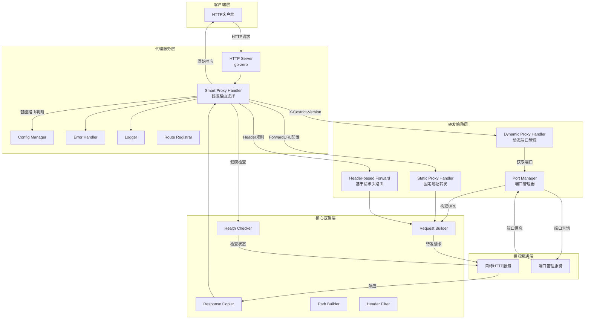

# HTTP协议转发功能技术设计文档

## 1. 设计概述

### 1.1 设计目标
基于现有Codebase Querier项目架构，实现智能HTTP反向代理功能，支持多种转发策略、动态端口管理、响应透传和错误处理。重点实现智能路由选择机制，根据请求头和配置自动选择最优转发策略。

### 1.2 设计范围
- 智能代理处理器实现
- 动态端口管理集成
- 多种转发策略支持
- 配置管理集成
- 错误处理机制
- 性能优化策略
- 安全控制措施
- 基于请求头的路由
- 健康检查机制

## 2. 技术选型

### 2.1 技术栈选择
| 组件 | 技术 | 版本 | 选择理由 |
|------|------|------|----------|
| 框架 | go-zero | v1.8.3 | 与现有项目保持一致，提供完整Web框架 |
| HTTP客户端 | net/http | Go标准库 | 性能优秀，无需额外依赖 |
| 配置管理 | go-zero config | 内置 | 与现有配置系统兼容 |
| 日志 | go-zero logx | 内置 | 统一日志格式和级别 |
| 监控 | Prometheus | 集成 | 利用go-zero内置监控支持 |
| 端口管理 | 自定义实现 | 内置 | 支持动态端口获取和缓存 |

### 2.2 技术方案对比
| 方案 | 优点 | 缺点 | 选择结果 |
|------|------|------|----------|
| **智能代理架构** | 自动路由选择，灵活策略 | 实现复杂，需要多种处理器 | ✅ 选择 |
| **单一静态代理** | 实现简单，性能稳定 | 功能有限，不够灵活 | ❌ 放弃 |
| **第三方代理库** | 功能丰富，开箱即用 | 增加依赖，定制困难 | ❌ 放弃 |

## 3. 系统架构

### 3.1 整体架构图


### 3.2 模块划分

#### 3.2.1 配置模块 (internal/config/proxy.go)
- **职责**: 管理代理配置，支持多种转发策略
- **功能**:
  - 解析YAML配置文件
  - 支持环境变量覆盖
  - 配置验证和错误提示
  - 多种代理模式配置管理
  - 动态端口管理配置
  - 基于请求头的转发配置

#### 3.2.2 智能代理处理器 (internal/handler/smart_proxy.go)
- **职责**: 智能路由选择，根据请求头和配置自动选择转发策略
- **功能**:
  - 请求头分析 (X-Costrict-Version)
  - 转发策略自动选择
  - 静态代理和动态代理协调
  - 基于请求头的路由
  - 统一健康检查接口

#### 3.2.3 动态代理处理器 (internal/handler/dynamic_proxy.go)
- **职责**: 处理动态端口代理请求
- **功能**:
  - 端口信息获取和缓存
  - 动态URL构建
  - 请求体处理 (GET/POST分离)
  - 错误处理和响应

#### 3.2.4 静态代理处理器 (internal/handler/proxy.go)
- **职责**: 处理固定地址代理请求
- **功能**:
  - 路径重写和全路径支持
  - 请求转发和响应复制
  - Header过滤和重写
  - 健康检查实现

#### 3.2.5 路由注册模块 (internal/handler/routes.go)
- **职责**: 注册HTTP路由，支持动态和静态路由
- **功能**:
  - 智能代理处理器注册
  - 健康检查路由注册
  - 动态端口模式路由注册
  - 多方法支持 (GET, POST, PUT, DELETE等)

#### 3.2.6 端口管理器 (internal/utils/proxy/port_manager.go)
- **职责**: 管理动态端口信息，提供端口获取服务
- **功能**:
  - 端口信息获取和缓存
  - 多种clientId获取方式支持
  - 缓存过期管理
  - 目标URL构建

## 4. 智能代理架构设计

### 4.1 架构设计理念
当前系统采用智能代理架构，通过多种转发策略的组合，实现灵活、高效的请求转发。核心设计理念包括：

1. **智能路由选择**: 根据请求头和配置自动选择最优转发策略
2. **多策略支持**: 支持动态端口、固定地址、基于请求头等多种转发方式
3. **统一接口**: 所有代理策略提供统一的HTTP处理接口
4. **健康检查**: 完善的健康检查机制，确保服务可用性

### 4.2 智能代理处理器设计

#### 4.2.1 转发策略选择逻辑
```go
// SmartProxyHandler.ServeHTTP 转发策略选择
func (h *SmartProxyHandler) ServeHTTP(w http.ResponseWriter, r *http.Request) {
    // 1. 检查基于请求头的转发
    if h.proxyConfig.HeaderBasedForward.Enabled {
        for _, pathConfig := range h.proxyConfig.HeaderBasedForward.Paths {
            if r.URL.Path == pathConfig.Path {
                headerValue := r.Header.Get(h.proxyConfig.HeaderBasedForward.HeaderName)
                if headerValue != "" {
                    h.forwardToURL(w, r, pathConfig.WithHeaderURL)
                } else {
                    h.forwardToURL(w, r, pathConfig.WithoutHeaderURL)
                }
                return
            }
        }
    }
    
    // 2. 检查X-Costrict-Version请求头
    costrictVersion := r.Header.Get("X-Costrict-Version")
    if costrictVersion != "" {
        h.dynamicProxyHandler.ServeHTTP(w, r) // 使用动态代理
        return
    }
    
    // 3. 检查ForwardURL配置
    if h.staticProxyHandler != nil {
        h.staticProxyHandler.ServeHTTP(w, r) // 使用静态代理
        return
    }
    
    // 4. 默认使用动态代理
    h.dynamicProxyHandler.ServeHTTP(w, r)
}
```

#### 4.2.2 优势分析
- **灵活性**: 支持多种转发策略，可根据业务需求灵活配置
- **智能性**: 自动根据请求特征选择最优转发策略
- **可扩展性**: 易于添加新的转发策略
- **兼容性**: 保持向后兼容，现有配置无需修改

### 4.3 动态端口管理

#### 4.3.1 端口管理器设计
```go
// PortManager 端口管理器核心功能
type PortManager struct {
    baseURL    string
    forwardURL string
    httpClient *http.Client
    cache      map[string]PortResponse
    cacheExp   time.Duration
    lastUpdate map[string]time.Time
    mu         sync.RWMutex
}

// 支持多种clientId获取方式
func (pm *PortManager) GetPortFromHeaders(ctx context.Context, method string, headers http.Header, params map[string][]string, body []byte) (*PortResponse, error) {
    var clientID string
    
    if method == "GET" {
        // GET请求从params获取
        clientID = params["clientId"][0]
    } else {
        // 其他请求从body获取
        var requestBody map[string]interface{}
        json.Unmarshal(body, &requestBody)
        clientID = requestBody["clientId"].(string)
    }
    
    return pm.GetPort(ctx, clientID, "codebase-indexer", headers)
}
```

#### 4.3.2 缓存机制
- **本地缓存**: 端口信息本地缓存，减少远程调用
- **过期管理**: 支持缓存过期时间配置，默认5分钟
- **并发安全**: 使用读写锁保证并发安全
- **性能优化**: 缓存命中时直接返回，避免网络延迟

### 4.4 路由注册优化

#### 4.4.1 统一路由注册
```go
func RegisterHandlers(server *rest.Server, serverCtx *svc.ServiceContext) {
    // 1. 注册健康检查路由
    registerHealthCheckRoutes(server, serverCtx)
    
    // 2. 注册智能代理路由
    if serverCtx.Config.ProxyConfig != nil {
        proxyHandler := NewSmartProxyHandler(serverCtx.Config.ProxyConfig)
        
        methods := []string{
            http.MethodGet, http.MethodPost, http.MethodPut,
            http.MethodDelete, http.MethodPatch, http.MethodHead, http.MethodOptions,
        }
        
        var routes []rest.Route
        for _, routeConfig := range serverCtx.Config.ProxyConfig.Routes {
            for _, method := range methods {
                routes = append(routes, rest.Route{
                    Method:  method,
                    Path:    routeConfig.PathPrefix,
                    Handler: http.HandlerFunc(proxyHandler.ServeHTTP),
                })
            }
        }
        
        server.AddRoutes(routes)
    }
}
```

#### 4.4.2 动态路由支持
- **配置驱动**: 路由配置从配置文件读取，支持动态修改
- **多方法支持**: 支持所有常见HTTP方法
- **灵活路径**: 支持任意路径前缀配置
- **统一处理**: 所有路由使用统一的智能代理处理器

### 4.5 健康检查机制

#### 4.5.1 多层健康检查
```go
// SmartProxyHandler.HealthCheck 统一健康检查接口
func (h *SmartProxyHandler) HealthCheck(w http.ResponseWriter, r *http.Request) {
    healthStatus := &HealthStatus{
        Strategy: "smart",
    }
    
    // 检查动态代理健康状态
    dynamicHealth := h.checkDynamicProxyHealth(r)
    healthStatus.DynamicProxy = dynamicHealth
    
    // 检查静态代理健康状态
    if h.staticProxyHandler != nil {
        staticHealth := h.checkStaticProxyHealth(r)
        healthStatus.StaticProxy = staticHealth
    }
    
    // 检查基于请求头的转发配置
    if h.proxyConfig.HeaderBasedForward.Enabled {
        healthStatus.HeaderBasedForward = h.getHeaderBasedForwardStatus()
    }
    
    json.NewEncoder(w).Encode(response)
}
```

#### 4.5.2 健康检查特性
- **全面性**: 检查所有转发策略的健康状态
- **实时性**: 实时检查目标服务可用性
- **性能监控**: 记录响应时间等性能指标
- **错误诊断**: 提供详细的错误信息和诊断数据

## 5. 数据模型设计

### 5.1 配置结构
```go
// ProxyConfig 代理配置
type ProxyConfig struct {
    Mode           string            `json:"mode" yaml:"mode"`     // 代理模式: rewrite, full_path
    Routes         []RouteConfig     `json:"routes" yaml:"routes"` // 路由规则数组
    Rewrite        RewriteConfig     `json:"rewrite" yaml:"rewrite"`
    Headers        HeadersConfig     `json:"headers" yaml:"headers"`
    PortManagerURL string            `json:"port_manager_url" yaml:"port_manager_url"` // 端口管理器URL
    DynamicPort    bool              `json:"dynamic_port" yaml:"dynamic_port"`         // 是否启用动态端口
    PortManager    PortManagerConfig `json:"port_manager" yaml:"port_manager"`         // 端口管理器配置
    ForwardURL     string            `json:"forward_url" yaml:"forward_url"`           // 转发地址
    HeaderBasedForward HeaderBasedForwardConfig `json:"header_based_forward" yaml:"header_based_forward"` // 基于请求头的转发配置
}

// HeaderBasedForwardConfig 基于请求头的转发配置
type HeaderBasedForwardConfig struct {
    Enabled    bool                           `json:"enabled" yaml:"enabled"`         // 是否启用基于请求头的转发
    HeaderName string                         `json:"header_name" yaml:"header_name"` // 请求头名称
    Paths      []HeaderBasedForwardPathConfig `json:"paths" yaml:"paths"`             // 多路径配置数组
}

// HeaderBasedForwardPathConfig 基于请求头的转发路径配置
type HeaderBasedForwardPathConfig struct {
    Path             string `json:"path" yaml:"path"`                             // 目标路径
    WithHeaderURL    string `json:"with_header_url" yaml:"with_header_url"`       // 有请求头时的转发地址
    WithoutHeaderURL string `json:"without_header_url" yaml:"without_header_url"` // 无请求头时的转发地址
}

// PortManagerConfig 端口管理器配置
type PortManagerConfig struct {
    URL                 string        `json:"url" yaml:"url"`                                         // 端口管理器URL
    ForwardURL          string        `json:"forward_url" yaml:"forward_url"`                         // 转发地址
    Timeout             time.Duration `json:"timeout" yaml:"timeout"`                                 // 请求超时时间
    CacheExp            time.Duration `json:"cache_exp" yaml:"cache_exp"`                             // 缓存过期时间
    MaxIdleConns        int           `json:"max_idle_conns" yaml:"max_idle_conns"`                   // 最大空闲连接数
    MaxIdleConnsPerHost int           `json:"max_idle_conns_per_host" yaml:"max_idle_conns_per_host"` // 每个主机的最大空闲连接数
    IdleConnTimeout     time.Duration `json:"idle_conn_timeout" yaml:"idle_conn_timeout"`             // 空闲连接超时时间
}

// RouteConfig 路由配置
type RouteConfig struct {
    PathPrefix string       `json:"path_prefix" yaml:"path_prefix"` // 路径前缀
    Target     TargetConfig `json:"target" yaml:"target"`           // 目标服务配置
}

// TargetConfig 目标服务配置
type TargetConfig struct {
    URL     string        `json:"url" yaml:"url"`
    Timeout time.Duration `json:"timeout" yaml:"timeout"`
}

// RewriteConfig 路径重写配置
type RewriteConfig struct {
    Enabled bool          `json:"enabled" yaml:"enabled"`
    Rules   []RewriteRule `json:"rules" yaml:"rules"`
}

// RewriteRule 重写规则
type RewriteRule struct {
    From string `json:"from" yaml:"from"`
    To   string `json:"to" yaml:"to"`
}

// HeadersConfig Header配置
type HeadersConfig struct {
    PassThrough bool              `json:"pass_through" yaml:"pass_through"`
    Exclude     []string          `json:"exclude" yaml:"exclude"`
    Override    map[string]string `json:"override" yaml:"override"`
}
```

### 5.2 端口管理数据模型
```go
// PortResponse 接口响应结构
type PortResponse struct {
    Port int `json:"mappingPort"`
}

// PortManager 端口管理器
type PortManager struct {
    baseURL    string
    forwardURL string
    httpClient *http.Client
    cache      map[string]PortResponse
    cacheExp   time.Duration
    lastUpdate map[string]time.Time
    mu         sync.RWMutex
}
```

### 5.3 处理器接口设计
```go
// SmartProxyHandler 智能代理处理器
type SmartProxyHandler struct {
    dynamicProxyHandler *DynamicProxyHandler
    staticProxyHandler  *ProxyHandler
    proxyConfig         *config.ProxyConfig
}

// DynamicProxyHandler 动态代理处理器
type DynamicProxyHandler struct {
    portManager *proxy.PortManager
    proxyConfig *config.ProxyConfig
}

// ProxyHandler 静态代理处理器
type ProxyHandler struct {
    proxyLogic *ProxyLogic
}
```

### 5.4 错误响应结构
```go
// ProxyError 代理错误响应
type ProxyError struct {
    Code      string    `json:"code"`
    Message   string    `json:"message"`
    Details   string    `json:"details,omitempty"`
    Timestamp time.Time `json:"timestamp"`
}

// 健康状态结构
type HealthStatus struct {
    DynamicProxy       map[string]interface{} `json:"dynamic_proxy"`
    StaticProxy        map[string]interface{} `json:"static_proxy,omitempty"`
    ForwardURL         string                 `json:"forward_url,omitempty"`
    HeaderBasedForward map[string]interface{} `json:"header_based_forward,omitempty"`
    Strategy           string                 `json:"strategy"`
}

## 6. API接口设计

### 6.1 智能转发接口
- **路径**: `{route_config.PathPrefix}` (根据配置动态决定)
- **方法**: GET, POST, PUT, DELETE, PATCH, HEAD, OPTIONS
- **描述**: 智能转发接口，根据请求头和配置自动选择转发策略
- **请求参数**:
  - X-Costrict-Version: 用于选择动态代理策略
  - clientId: 用于动态端口获取 (GET请求从params获取，其他请求从body获取)
  - 其他参数: 透传所有原始参数
- **转发策略**:
  1. 基于请求头的转发 (优先级最高)
  2. X-Costrict-Version请求头 → 动态代理
  3. ForwardURL配置 → 静态代理
  4. 默认 → 动态代理
- **响应格式**: 透传目标服务响应

### 6.2 健康检查接口
- **路径**: `/api/v1/proxy/health`
- **方法**: GET
- **描述**: 检查智能代理服务和所有转发策略的健康状态
- **响应格式**:
  ```json
  {
    "status": "ok",
    "proxy": {
      "strategy": "smart",
      "dynamic_proxy": {
        "healthy": true,
        "status_code": 200,
        "response": "OK"
      },
      "static_proxy": {
        "healthy": true,
        "response_time_ms": 45
      },
      "forward_url": "http://target-service:8080",
      "header_based_forward": {
        "enabled": true,
        "header_name": "X-Costrict-Version",
        "paths": [
          {
            "path": "/codebase-embedder/api/v1/search/semantic",
            "with_header_url": "codebase-embedder/api/v1/search/semantic",
            "without_header_url": "/codebase-index/api/v1/search/semantic"
          }
        ],
        "path_count": 1
      }
    }
  }
  ```

### 6.3 动态代理健康检查接口
- **路径**: `/api/v1/dynamic-proxy/health`
- **方法**: GET
- **描述**: 专门检查动态代理和端口管理器的健康状态
- **启用条件**: 当 `DynamicPort = true` 时自动注册
- **响应格式**:
  ```json
  {
    "status": "ok",
    "proxy": {
      "mode": "rewrite",
      "dynamic_port": true,
      "port_manager_url": "http://port-manager:8080",
      "reachable": true,
      "response_time_ms": 23
    }
  }
  ```

## 7. 函数接口设计

### 7.1 核心接口定义

#### 7.1.1 智能代理处理器接口
```go
// SmartProxyHandler 智能代理处理器
type SmartProxyHandler struct {
    dynamicProxyHandler *DynamicProxyHandler
    staticProxyHandler  *ProxyHandler
    proxyConfig         *config.ProxyConfig
}

func NewSmartProxyHandler(cfg *config.ProxyConfig) *SmartProxyHandler
func (h *SmartProxyHandler) ServeHTTP(w http.ResponseWriter, r *http.Request)
func (h *SmartProxyHandler) HealthCheck(w http.ResponseWriter, r *http.Request)
func (h *SmartProxyHandler) Close() error
```

#### 7.1.2 动态代理处理器接口
```go
// DynamicProxyHandler 动态代理处理器
type DynamicProxyHandler struct {
    portManager *proxy.PortManager
    proxyConfig *config.ProxyConfig
}

func NewDynamicProxyHandler(cfg *config.ProxyConfig) *DynamicProxyHandler
func (h *DynamicProxyHandler) ServeHTTP(w http.ResponseWriter, r *http.Request)
func (h *DynamicProxyHandler) HealthCheck(w http.ResponseWriter, r *http.Request)
func (h *DynamicProxyHandler) Close() error
```

#### 7.1.3 静态代理处理器接口
```go
// ProxyHandler 静态代理处理器
type ProxyHandler struct {
    proxyLogic *ProxyLogic
}

func NewProxyHandler(cfg *config.ProxyConfig) *ProxyHandler
func (h *ProxyHandler) ServeHTTP(w http.ResponseWriter, r *http.Request)
func (h *ProxyHandler) HealthCheck(w http.ResponseWriter, r *http.Request)
func (h *ProxyHandler) Close() error
```

#### 7.1.4 端口管理器接口
```go
// PortManager 端口管理器
type PortManager struct {
    baseURL    string
    forwardURL string
    httpClient *http.Client
    cache      map[string]PortResponse
    cacheExp   time.Duration
    lastUpdate map[string]time.Time
    mu         sync.RWMutex
}

func NewPortManager(baseURL string) *PortManager
func NewPortManagerWithConfig(config config.PortManagerConfig) *PortManager
func (pm *PortManager) GetPort(ctx context.Context, clientID, appName string, headers http.Header) (*PortResponse, error)
func (pm *PortManager) GetPortFromHeaders(ctx context.Context, method string, headers http.Header, params map[string][]string, body []byte) (*PortResponse, error)
func (pm *PortManager) BuildTargetURL(portResp *PortResponse) string
```

### 7.2 关键函数签名

#### 7.2.1 路由注册函数
```go
// RegisterHandlers 注册HTTP处理器
func RegisterHandlers(server *rest.Server, serverCtx *svc.ServiceContext)

// registerHealthCheckRoutes 注册健康检查路由
func registerHealthCheckRoutes(server *rest.Server, serverCtx *svc.ServiceContext)

// proxyHealthCheckHandler 代理健康检查处理器
func proxyHealthCheckHandler(serverCtx *svc.ServiceContext) http.HandlerFunc

// dynamicProxyHealthCheckHandler 动态代理健康检查处理器
func dynamicProxyHealthCheckHandler(serverCtx *svc.ServiceContext) http.HandlerFunc
```

#### 7.2.2 智能代理处理函数
```go
// ServeHTTP 处理智能代理请求
func (h *SmartProxyHandler) ServeHTTP(w http.ResponseWriter, r *http.Request)

// forwardToURL 转发请求到指定URL
func (h *SmartProxyHandler) forwardToURL(w http.ResponseWriter, r *http.Request, targetURL string)

// HealthCheck 健康检查
func (h *SmartProxyHandler) HealthCheck(w http.ResponseWriter, r *http.Request)

// checkDynamicProxyHealth 检查动态代理健康状态
func (h *SmartProxyHandler) checkDynamicProxyHealth(r *http.Request) map[string]interface{}

// checkStaticProxyHealth 检查静态代理健康状态
func (h *SmartProxyHandler) checkStaticProxyHealth(r *http.Request) map[string]interface{}
```

#### 7.2.3 动态代理处理函数
```go
// ServeHTTP 处理动态代理请求
func (h *DynamicProxyHandler) ServeHTTP(w http.ResponseWriter, r *http.Request)

// HealthCheck 动态代理健康检查
func (h *DynamicProxyHandler) HealthCheck(w http.ResponseWriter, r *http.Request)

// sendHealthCheckResponse 发送健康检查响应
func (h *DynamicProxyHandler) sendHealthCheckResponse(w http.ResponseWriter, healthy bool, duration time.Duration, errorMsg string)
```

#### 7.2.4 静态代理处理函数
```go
// Forward 执行请求转发
func (l *ProxyLogic) Forward(ctx context.Context, original *http.Request) (*http.Response, error)

// buildTargetRequest 构建目标请求
func (l *ProxyLogic) buildTargetRequest(ctx context.Context, original *http.Request) (*http.Request, error)

// HealthCheck 检查目标服务健康状态
func (l *ProxyLogic) HealthCheck(ctx context.Context) (bool, time.Duration, error)

// GetTargetURL 获取目标URL
func (l *ProxyLogic) GetTargetURL() string
```

#### 7.2.5 路径构建函数
```go
// BuildPath 构建路径（RewritePathBuilder实现）
func (b *RewritePathBuilder) BuildPath(originalPath string) (string, error)

// BuildPath 构建路径（FullPathBuilder实现）
func (b *FullPathBuilder) BuildPath(originalPath string) (string, error)

// rewritePath 重写路径
func rewritePath(path string, rules []UtilsRewriteRule) string

// cleanPath 清理路径
func cleanPath(path string) string

// joinPath 拼接路径
func joinPath(baseURL, path string) string

// GetPathBuilder 根据模式获取路径构建器
func GetPathBuilder(mode string, cfg *ProxyConfig) (PathBuilder, error)
```

#### 7.2.4 工具函数
```go
// FilterHeaders 过滤请求头
func FilterHeaders(headers http.Header, exclude []string, override map[string]string) http.Header

// CreateProxyError 创建统一错误响应
func CreateProxyError(code, message, details string) *ProxyError

// ValidateProxyMode 验证代理模式
func ValidateProxyMode(mode string) error
```

## 8. 全路径转发设计

### 8.1 全路径转发模式
- **模式标识**: `mode: "full_path"`
- **路径处理**: 保持原始URL完整路径不变
- **查询参数**: 保留所有查询参数
- **特殊字符**: 保持URL编码不变

### 8.2 路径构建逻辑


### 8.3 兼容性处理
- **配置验证**: 启动时检查mode和rewrite的兼容性
- **互斥逻辑**: full_path模式下自动禁用rewrite
- **错误提示**: 提供清晰的配置错误信息

## 9. 错误处理设计

### 9.1 错误码定义
| 错误码 | 描述 | HTTP状态码 | 场景 |
|--------|------|------------|------|
| PROXY_BAD_REQUEST | 请求格式错误 | 400 | 无效请求 |
| PROXY_TARGET_UNREACHABLE | 目标服务不可达 | 503 | 连接失败 |
| PROXY_TIMEOUT | 请求超时 | 504 | 超时 |
| PROXY_INTERNAL_ERROR | 内部错误 | 500 | 未知错误 |
| PROXY_INVALID_MODE | 无效代理模式 | 500 | 配置错误 |
| PROXY_PATH_MATCH_ERROR | 路径匹配错误 | 404 | 路径不匹配 |

### 9.2 错误处理流程


## 10. 性能优化策略

### 10.1 路由匹配优化
- **通配符优化**: 使用 `"/*"` 替代 `"/*path"` 提高匹配效率
- **路由缓存**: 利用 go-zero 内置的路由缓存机制
- **路径解析**: 优化路径解析逻辑，减少字符串操作

### 10.2 连接池优化
- **HTTP连接复用**: 使用http.Transport连接池
- **配置参数**:
  - MaxIdleConns: 100
  - MaxIdleConnsPerHost: 10
  - IdleConnTimeout: 90s

### 10.3 超时控制
- **连接超时**: 5秒
- **请求超时**: 可配置，默认30秒
- **响应头超时**: 10秒

### 10.4 内存优化
- **流式传输**: 大文件使用io.CopyBuffer
- **缓冲区复用**: 使用sync.Pool管理缓冲区
- **Header复制优化**: 避免不必要的Header拷贝

## 11. 安全设计

### 11.1 Header安全
- **敏感Header过滤**: 支持配置排除规则
- **Host Header处理**: 自动替换为目标地址
- **Connection Header**: 移除Connection相关Header

### 11.2 请求验证
- **方法验证**: 仅允许标准HTTP方法
- **URL长度限制**: 最大8KB
- **Header大小限制**: 最大1MB
- **路径安全**: 防止路径遍历攻击

### 11.3 响应安全
- **状态码透传**: 不修改原始状态码
- **Header透传**: 仅过滤明确配置的Header
- **内容长度限制**: 可配置最大响应大小

## 12. 测试策略

### 12.1 单元测试
- **覆盖率目标**: >85%
- **测试范围**:
  - 配置解析和验证
  - 路径重写逻辑
  - 全路径构建逻辑
  - 模式切换逻辑
  - Header过滤功能
  - 错误处理
  - 路径匹配逻辑（新增）

### 12.2 集成测试
- **测试场景**:
  - 正常请求转发（两种模式）
  - 各种HTTP方法
  - 多级路径转发
  - 查询参数传递
  - 特殊字符处理
  - 错误情况处理
  - 并发请求处理
  - 模式切换测试

### 12.3 路径匹配专项测试
```go
// 路径匹配测试用例
func TestPathMatching(t *testing.T) {
    tests := []struct {
        name     string
        mode     string
        path     string
        expected bool
    }{
        // 全路径模式测试
        {"full_path_root", "full_path", "/", true},
        {"full_path_single", "full_path", "/api", true},
        {"full_path_multi", "full_path", "/api/v1/users", true},
        {"full_path_query", "full_path", "/search?q=test", true},
        {"full_path_special", "full_path", "/path%20with%20spaces", true},
        
        // 重写模式测试
        {"rewrite_root", "rewrite", "/api/v1/proxy/health", true},
        {"rewrite_api", "rewrite", "/api/v1/proxy/users", true},
        {"rewrite_query", "rewrite", "/api/v1/proxy/search?q=test", true},
        
        // 边界情况测试
        {"empty_path", "full_path", "", true},
        {"long_path", "full_path", "/a/very/long/path/with/many/segments", true},
    }
    
    for _, tt := range tests {
        t.Run(tt.name, func(t *testing.T) {
            // 测试路径匹配逻辑
        })
    }
}
```

### 12.4 性能测试
- **基准测试**:
  - 单请求延迟 < 100ms
  - 并发100请求成功率 > 99%
  - 内存使用稳定
  - 全路径模式性能对比
  - 路径匹配性能基准

## 13. 部署配置

### 13.1 配置文件扩展
```yaml
# 全路径转发配置示例
proxy:
  mode: "full_path"  # 新增：支持"rewrite"和"full_path"
  target:
    url: "http://target-service:8080"
    timeout: 30s
  headers:
    pass_through: true
    exclude:
      - "X-Internal-*"
    override:
      Host: "target-service"

# 路径重写配置示例（向后兼容）
proxy:
  mode: "rewrite"  # 默认为rewrite模式
  target:
    url: "http://target-service:8080"
    timeout: 30s
  rewrite:
    enabled: true
    rules:
      - from: "/api/v1/proxy"
        to: ""
  headers:
    pass_through: true
    exclude:
      - "X-Internal-*"
    override:
      Host: "target-service"
```

### 13.2 环境变量支持
- `PROXY_MODE`: 覆盖代理模式（rewrite/full_path）
- `PROXY_TARGET_URL`: 覆盖目标地址
- `PROXY_TIMEOUT`: 覆盖超时时间
- `PROXY_REWRITE_ENABLED`: 启用/禁用重写

## 14. 监控和日志

### 14.1 监控指标
- **请求计数**: proxy_requests_total（按模式分组）
- **响应时间**: proxy_request_duration_seconds
- **错误率**: proxy_errors_total
- **连接状态**: proxy_target_connection_status
- **模式分布**: proxy_mode_usage（rewrite/full_path）
- **路径匹配指标**: proxy_path_matches_total（新增）

### 14.2 日志规范
- **访问日志**: 记录每个请求的方法、路径、模式、状态码、响应时间
- **错误日志**: 记录错误详情和堆栈信息
- **调试日志**: 记录请求和响应的详细内容（开发模式）
- **模式切换日志**: 记录代理模式的变更
- **路径匹配日志**: 记录路径匹配结果（新增）

## 15. 风险缓解

### 15.1 技术风险
| 风险 | 概率 | 影响 | 缓解措施 |
|------|------|------|----------|
| 路径匹配失败 | 中 | 高 | 使用 "/*" 通配符，全面测试路径匹配 |
| 内存泄漏 | 低 | 高 | 使用pprof监控，定期压测 |
| 连接泄露 | 低 | 中 | 使用连接池，设置超时 |
| 配置错误 | 中 | 中 | 启动时验证，提供详细错误 |
| 模式冲突 | 低 | 中 | 严格的配置验证和互斥逻辑 |

### 15.2 业务风险
- **目标服务变更**: 支持配置热加载
- **性能瓶颈**: 提供性能监控和告警
- **安全问题**: 提供Header过滤和审计日志
- **路径冲突**: 提供模式切换配置，避免与现有路径冲突

## 16. 后续扩展计划

### 16.1 V2版本功能
- WebSocket支持
- 负载均衡
- 请求/响应日志
- 基本认证
- 路径路由规则

### 16.2 V3版本功能
- 缓存机制
- 限流功能
- 响应内容修改
- Web界面配置
- 多目标服务支持

### 16.3 路径匹配增强
- 支持正则表达式路径匹配
- 支持动态路由参数
- 支持路径优先级配置
- 支持自定义路径匹配器